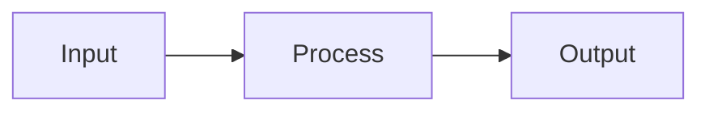

# Diagram conventions

## Purpose

Diagrams can make structure, relationships, sequence, state, and data flow easier to understand. They are supporting material, not a replacement for the written knowledge.

## Default format

Use Mermaid fenced code blocks as the default format for technical diagrams in canonical Markdown.

````text

````

The Mermaid source is canonical. It stays in Git, renders on GitHub, and renders on the Astro/Starlight site through the local `astro-mermaid` integration.

DKKB does not use a hosted diagram-rendering service. Diagram source and rendering dependencies remain inside the repository and generated site.

## When to use a diagram

Use a diagram when it makes an important relationship easier to understand. Common cases include:

- architecture and dependency relationships;
- request, control, or data flow;
- state transitions;
- interaction sequences;
- entity relationships;
- decision paths.

Do not add a diagram when prose, a short list, or a table communicates the same information more clearly.

Do not add decorative diagrams.

## Content requirements

A diagram must agree with the surrounding prose. The prose must contain the essential meaning needed to understand the entry without the rendered diagram.

Use concise labels and the same terminology as the article. Split a diagram when it becomes difficult to scan.

Do not use color as the only way to communicate meaning. Prefer labels, shapes, relationships, and explicit text.

## Sources and copyright

The DKKB source policy also applies to diagrams.

Do not copy protected diagrams, illustrations, or visual examples from books or websites. Reconstruct the underlying engineering concept in an original diagram when a visual explanation is useful, and cite the relevant knowledge source when appropriate.

## Static diagrams

Use a static diagram only when Mermaid cannot represent the subject clearly or when exact visual layout is materially important.

Prefer SVG over raster formats for technical diagrams when practical. Keep an editable or source representation in the repository when practical.

Static diagrams must include useful alternative text when embedded in content.

## Validation

The normal DKKB quality gate must continue to pass when diagrams are added.

Mermaid syntax is not separately validated in CI at this stage. Review the rendered result on GitHub and on the generated site. Add dedicated Mermaid validation only when repository usage justifies the additional dependency and maintenance cost.
