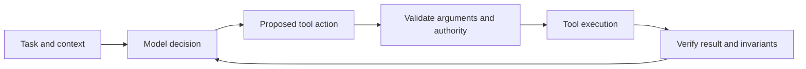

# Bound AI agents by authority and verification

An AI agent combines model decisions with tools that can read or change external state. Tool access converts model error from text risk into action risk.

The model can propose an action. Independent controls decide whether the action is allowed and whether its result is acceptable.

## Authority boundary

Grant the minimum permissions needed for the task. Separate read access from write access when practical. Keep destructive, financial, security-sensitive, or production actions behind stronger controls.

Do not rely on prompt instructions as the only authorization mechanism.

:::danger[Write authority changes the risk class]
A model mistake that only produces text can often be reviewed. The same mistake with destructive or production write access can change real state before a human sees it.
:::

## Verification boundary

Validate tool arguments before execution and validate tool results before using them as trusted facts. Require explicit checks for invariants that must always hold.

For consequential workflows, bind approval and execution to the same reviewed state so the agent cannot silently act on a changed target.

## AI-assisted software development

Agents can search code, draft changes, run tests, and prepare pull requests. Repository checks and human review remain independent evidence.

Do not treat generated code, a passing narrow test, or an agent's self-review as proof that a change is correct.

## Failure modes

Excessive authority increases blast radius. Weak tool schemas allow ambiguous actions. Long autonomous workflows can accumulate stale assumptions or continue after the environment changes.

Use bounded tasks, observable state, deterministic gates, and explicit stop conditions when uncertainty rises.
