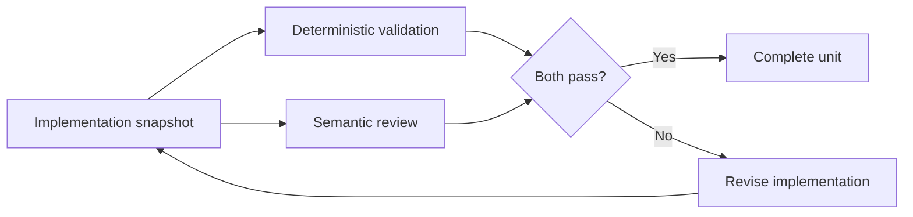

# Bound AI implementation work to one verifiable unit

An AI coding agent has a limited working context and can lose important assumptions as a task grows.

Size implementation work so one unit can be understood, changed, validated, and reviewed against explicit acceptance criteria before the agent moves on.

## A bounded implementation unit

A useful unit has:

- one clear objective;
- explicit in-scope and out-of-scope boundaries;
- known files, components, or behavior to inspect;
- acceptance criteria that can be checked;
- a validation plan;
- a defined end state.

The unit can still be technically difficult. The important property is that completion can be evaluated without relying on undocumented context from earlier work.

## Separate implementation from validation

Do not treat an agent's statement that work is complete as proof that the work is correct.

Use at least two kinds of evidence when practical:

1. deterministic checks such as tests, builds, linters, schema validation, or reproducible commands;
2. semantic review that asks whether the implementation actually satisfies the intended behavior and constraints.

A passing build can prove syntax and integration properties. It cannot prove every product or architecture requirement.

## Bind validation to one snapshot

Validation should refer to the same implementation state.

If the implementation changes after one validation pass, that evidence may no longer describe the current state.

Re-run the checks affected by the change instead of combining evidence from different snapshots.

## Keep acceptance criteria observable

An acceptance criterion should describe a state that another reviewer can inspect.

Prefer criteria such as:

- endpoint returns the documented representation;
- migration remains resumable after interruption;
- test proves ordering is independent from affiliate metadata;
- build and repository quality gate pass.

Avoid criteria such as "clean implementation" or "production ready" unless the repository defines what those terms require.

## Stop when context is no longer trustworthy

Long tasks can outgrow the context that made the implementation safe.

Warning signs include:

- the agent cannot restate key constraints without re-reading them;
- earlier decisions are repeatedly rediscovered;
- validation results no longer have a clear relationship to the current code;
- the task has expanded into several independent changes;
- context compaction removes details required to continue safely.

When this happens, stop the current unit at a stable boundary and create a handoff for the remaining work.

Do not continue only because the original issue is still open.

## Handoff should preserve state, not memory

A handoff should make the next unit reconstructible from durable artifacts.

Useful handoff information includes:

- current branch and commit;
- completed acceptance criteria;
- validation that passed or failed;
- unresolved risks;
- exact remaining work;
- links to relevant issues, decisions, or documentation.

Prefer repository state and issue history over a prose summary that cannot be verified.

## Decompose before implementation when possible

A large initiative should be divided before an agent starts editing code when the boundaries are already visible.

Separate units when they have different:

- acceptance criteria;
- failure modes;
- validation methods;
- ownership boundaries;
- deployment or migration steps.

Do not split work mechanically by file count. One coherent behavior can span several files and still be a valid unit.

## Failure modes

### One issue becomes an unlimited work container

The agent keeps discovering and implementing adjacent work. Review becomes difficult because the final change no longer has one testable purpose.

### Validation is accepted from an older snapshot

Tests passed, code changed afterward, and the task still reports the earlier result as current evidence.

### The agent reviews its own claim only through tests

Deterministic checks pass, but an architectural or semantic requirement was never implemented.

### Context loss is treated as normal continuation

The agent continues after losing assumptions that were necessary to make safe decisions. It may recreate rules incorrectly or contradict earlier work.

### Handoff contains conclusions but not evidence

The next agent receives "almost done" without commit identity, failed checks, or remaining acceptance criteria.

## When larger units are acceptable

Do not split a coherent change only to make every task small.

A larger unit can be appropriate when:

- the behavior is tightly coupled;
- one validation suite covers the whole change;
- splitting would create invalid intermediate states;
- the agent can keep the required context reliable.

The goal is bounded verifiability, not minimum task size.

## Practical rule

Give an AI coding agent one implementation unit that can end in a specific, independently verifiable state.

If the context needed to continue safely is lost, preserve the current state and hand off the remaining work instead of silently extending the same unit.
