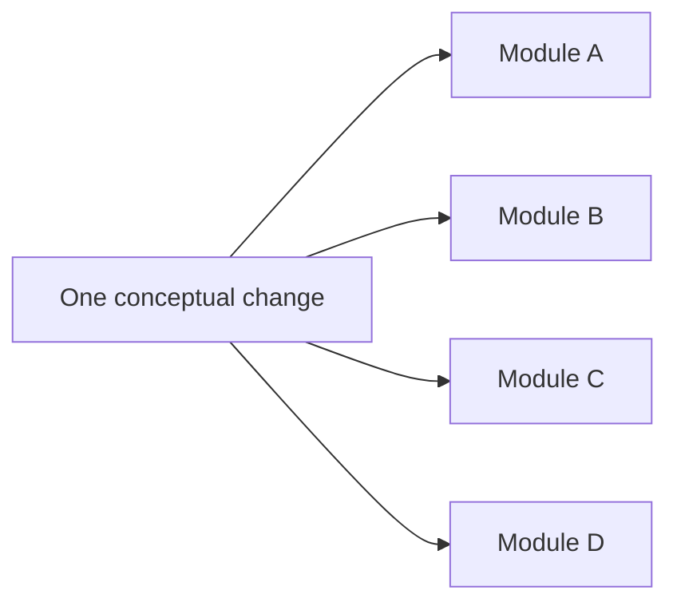

# Shotgun surgery

Shotgun Surgery occurs when one conceptual change requires many small edits in many locations.

## Observable symptoms

A change to one rule, field, protocol, or behavior repeatedly touches several modules that do not otherwise need to change together.

The same group of files often appears together in change history.

## Why it happens

The system may duplicate knowledge, expose representation details too widely, or split one responsibility across several weak boundaries.

## Consequences

Developers can miss one required edit. Review becomes harder because the intent is distributed across many files.

The cost of a simple conceptual change grows with the number of synchronized locations.

## Mitigation

Find the concept that causes the files to change together. Move the knowledge or behavior behind one authoritative boundary when that boundary is cohesive.

Use generated artifacts when several representations must remain synchronized from one source.

:::caution[Coordinated migration is not always a smell]
A protocol or schema migration can legitimately touch several real boundaries. The smell appears when routine changes repeatedly scatter because one concept has no clear owner.
:::

## When not to over-correct

Some cross-cutting changes are legitimate. A security policy update, protocol migration, or deliberate schema version change can require coordinated edits across real boundaries.

Do not combine independent modules only to reduce the number of files in one migration.

## Sources

- Martin Fowler. *Refactoring: Improving the Design of Existing Code*. Addison-Wesley.
