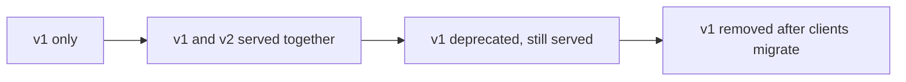

# API versioning and evolution

A published API has clients you do not control and cannot upgrade on command. Evolution is the problem of changing that API over time while those clients keep working.

Versioning is one tool for evolution, not the whole answer.

The default goal is compatible evolution: change the API so existing clients keep working without any action. Reach for an explicit new version only when a change cannot be made compatibly.

## Prefer compatible change

Most useful changes can be additive. The compatibility entry lists which changes are safe: adding an optional input, adding a response field, adding an operation, adding an optional error case.

Two client-side habits make additive change possible.

A client that ignores unknown fields lets the server add fields freely. A client that does not depend on incidental behavior lets the server change what it never promised.

When both hold, most growth needs no version bump at all.

Compatible evolution fails when a change must remove, rename, or redefine something clients rely on. At that point you need an explicit version step, because no additive change expresses it.

## Versioning strategies

When a breaking change is unavoidable, the API needs to serve both the old and new behavior during a transition. Common strategies place the version in different places.

- Version in the path, such as a version segment in the URL. It is explicit and easy to route, but it versions the whole surface at once even for a small change.
- Version in a header or media type through content negotiation. It keeps resource identifiers stable and can version per representation, but it is less visible and easy to get wrong in caches and tooling.
- Version a single field or operation. The rest of the contract stays stable, which limits the blast radius but can spread many small version markers across the surface.

No single choice is correct for every API. The trade-off is between how coarse the version unit is and how visible and simple the mechanism is.

## Manage the transition with an overlap window

A breaking change should not be a flag day where every client must switch at one instant. The stable pattern is an overlap window where both versions run.

The steps are: publish the new version beside the old, announce a deprecation for the old version with a signal clients can detect, watch usage until it falls, then remove the old version.

This is the same shape as an expand-and-contract migration. The safe online data migrations entry covers that pattern for stored data, and the same reasoning applies to an interface.

Removing the old version too early breaks clients that have not migrated. Keeping it forever multiplies maintenance and testing cost, because every change must satisfy every retained version.

## Client and server responsibilities

The server owns the transition. It must keep the old behavior correct while both versions run, signal deprecation clearly, and remove the old version only after usage is safe to drop.

The client should pin the version it was written for, so a new server default does not change behavior under it.

During a transition, the client migrates to the new version within the announced window rather than depending on the old version staying forever.

## Trade-offs

A coarse version unit, such as a whole-API path version, is simple to reason about and route. It forces clients to move even for a change that did not affect them.

A coarse unit also tends to accumulate long-lived parallel versions.

A fine version unit, such as per-field or per-operation, limits how much a client must change, but it spreads version logic across the surface and is harder to track.

A long overlap window is gentle on clients and reduces forced upgrades. It raises the cost of every later change, because the server must keep satisfying the retained versions.

A short window lowers maintenance but pressures clients and risks breaking slow movers.

## Common failure modes

- Treating a version bump as a substitute for compatibility, so the API breaks clients on every minor change and forces constant migration.
- Changing default behavior under an existing version, which breaks clients that pinned it and expected stability.
- Removing an old version before usage has dropped, which breaks the clients that had not migrated.
- Keeping every old version alive indefinitely, so the maintenance and test burden grows without bound.
- Assuming a change is non-breaking because it is undocumented, when clients depend on the observed behavior, as Hyrum's Law describes.
- Redefining the meaning of an existing field instead of adding a new one, so old and new clients disagree silently.

## Relationships to other boundaries

Versioning is the mechanism that lets the contract in the compatibility entry change over time.

The two entries are complements: compatibility defines what is safe to change in place, and versioning handles the changes that are not.

Evolution also touches reliability. During an overlap window both versions run at once, and idempotent operations make it safe for a client to retry across the switch.

The provider-neutral integration boundary entry covers the mirror-image case. When you are the client, an owned boundary limits how far an upstream provider's version change reaches into your system.

## Sources

- Tom Preston-Werner. "Semantic Versioning 2.0.0." Accessed 2026.
- Internet Engineering Task Force. "RFC 9110: HTTP Semantics." 2022.
- Hyrum Wright. "Hyrum's Law." Accessed 2026.
