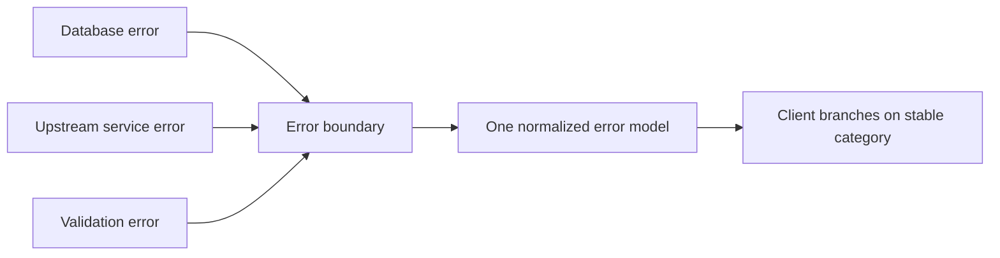

# Error modeling and error normalization

An error model is the part of the contract that describes how an operation fails.

A client needs to answer three questions from a failure: what went wrong, whose fault it is, and what to do next.

An error that only says "something failed" forces the client to guess. A good error model removes that guesswork with a stable, machine-readable signal.

## What a client needs from an error

An actionable error normally carries:

- a stable category the client can branch on, such as invalid input, not found, conflict, unauthorized, rate limited, or unavailable;
- whether the failure is the client's fault or the server's fault;
- whether a retry can succeed, and after how long;
- enough detail to locate the specific problem, such as which field was invalid;
- a human-readable message for logs and developers.

The category must be stable and machine-readable. A client should branch on a code or type, not on the text of a message.

Message text is for humans and can change without warning, so a client that parses it depends on incidental behavior.

## Separate fault classes

The first split is whose fault the failure is. HTTP encodes this as the 4xx class for client errors and the 5xx class for server errors.

- A client error means the request was wrong: bad input, missing authorization, a conflict with current state. Repeating the same request unchanged will fail again.
- A server error means the server could not complete a valid request. The same request may succeed later.

This split drives client behavior. A client should not retry a client error unchanged, because it will fail the same way.

A client may retry a server error under a backoff policy. The retries and backoff entry covers doing that without amplifying load.

## Normalize errors at each boundary

Normalization means mapping many underlying failure shapes into one consistent model at a boundary. Without it, each downstream dependency leaks its own error format to the client.

A standard format helps. RFC 9457 defines Problem Details: a stable type identifier for the error class, a short title, the status, and a per-occurrence detail.

A client branches on the type, and a human reads the detail.

The diagram shows one boundary translating heterogeneous internal failures into a single external model, so clients depend on one shape.

The provider-neutral integration boundary entry covers the same idea for outbound calls: translate a provider's error codes into the application's own stable failure categories.

## Client and server responsibilities

The server defines the error categories, keeps them stable, and returns the right fault class.

It must not return a success status for a failed operation, and it must not leak internal detail that helps an attacker.

The client branches on the stable category, respects retry signals, and does not parse human-readable text for control flow.

## Trade-offs

Detailed errors help clients and developers diagnose problems quickly. Detail that exposes internal structure, stack traces, or which of several checks failed can leak information that aids an attacker.

The secure defaults entry covers failing closed and not revealing internals in an error.

A fine-grained set of categories lets clients react precisely. Too many categories are hard for clients to handle, and adding one later can be a breaking change if clients treated the set as closed.

A single generic error is simple to produce and safe to expose. It gives the client nothing to act on beyond retry-or-fail.

The balance is a small, stable set of categories with safe detail, plus richer diagnostics kept in server logs rather than in the client-facing response.

## Common failure modes

- Returning a success status with an error in the body. Clients, caches, and retries then treat a failure as a success.
- Making the client parse message text. A wording change silently breaks client logic.
- Collapsing distinct failures into one category, so the client cannot tell a retryable outage from a permanent rejection.
- Leaking internal exceptions or stack traces to the client, which exposes implementation detail and possible attack surface.
- Mislabeling a client error as a server error, which invites retries that will always fail and can hide a real bug.
- Passing a downstream provider's raw error straight through, so the client couples to a dependency it never chose.

## Relationships to other boundaries

Error modeling is where API design meets reliability. The categories defined here decide what a client can retry, so the retries, timeouts, and circuit breaker entries all depend on a clear retryable-versus-permanent signal.

It also meets security. An error is an output, and the secure defaults entry covers keeping that output free of internal detail while still failing closed.

The error model is part of the contract. The compatibility entry covers evolving the category set without breaking clients that already branch on it.

## Sources

- Internet Engineering Task Force. "RFC 9457: Problem Details for HTTP APIs." 2023.
- Internet Engineering Task Force. "RFC 9110: HTTP Semantics." 2022.
