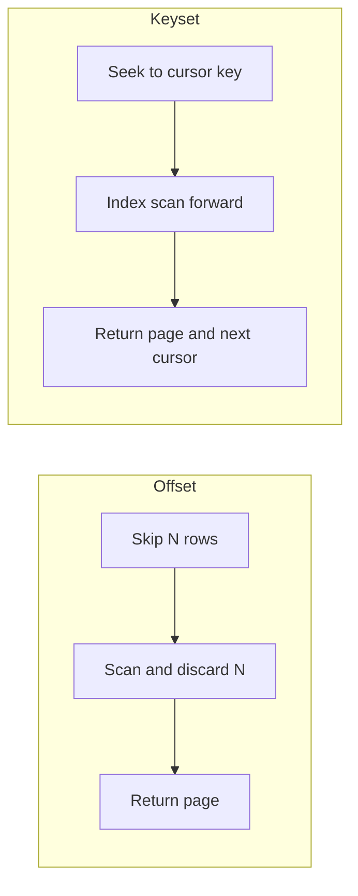

# Pagination and bounded collection reads

A collection endpoint that returns every matching row is unbounded: its cost grows with the data, not with what the client needs.

Pagination replaces one unbounded read with a sequence of bounded reads, each returning a page of limited size.

The core rule is that no single read should scale with total collection size. This is the bounded work principle applied to an API boundary. The bounded work entry covers the principle in general.

## The contract of a paged read

A paged endpoint promises three things:

- each response contains at most a bounded number of items;
- the client can request the next page with a token or parameter the response provides;
- the ordering is defined and stable enough that paging does not skip or repeat items without saying so.

The server should cap page size even when a client asks for more.

A client-controlled limit with no server maximum is still an unbounded read, because one caller can request the whole collection in one page.

## Offset paging versus keyset paging

Two mechanisms are common. They differ in cost and in stability under concurrent writes.

Offset paging skips a number of rows and returns the next page. It is simple and allows random access to any page.

Offset paging has two problems at scale. The database still scans and discards the skipped rows, so a deep page does work proportional to the offset.

If rows are inserted or deleted while the client pages, the offset shifts, so the client can skip or repeat items.

Keyset paging, also called cursor paging, returns items after a stable key value from the previous page. The next request asks for items after that key.

The database can seek to the key using an index instead of scanning skipped rows, so page cost stays roughly constant.

Because the cursor is a value in the data, inserts and deletes elsewhere do not shift the window.

Keyset paging gives up cheap random access to an arbitrary page number.

The diagram contrasts the work each mechanism does per page. Offset cost grows with depth; keyset cost stays bounded when an index covers the ordering key.

The indexes and query planning entry covers why an index on the ordering key is what makes keyset paging cheap.

## Ordering must be stable

Pagination assumes a total order over the collection.

If two items can share the same sort value, the order between them is not defined, and a page boundary can fall in the middle of the tie inconsistently.

Order by a key that is unique, or add a unique tiebreaker such as an identifier to the sort.

Without a stable order, both offset and keyset paging can skip or duplicate items across pages even with no concurrent writes.

## Client and server responsibilities

The server caps page size, defines the ordering, and returns a cursor or next-page signal. It should treat the cursor as opaque to the client so it can change the cursor encoding without breaking callers.

The client follows the server's next-page signal rather than constructing offsets by hand, and it stops when the server reports no more pages.

A client should not assume it can jump to an arbitrary page unless the contract offers that.

## Trade-offs

Offset paging is easy to build and supports jump-to-page. It degrades on deep pages and is unstable under concurrent writes.

Keyset paging holds bounded cost and stays stable under writes. It cannot offer cheap arbitrary-page access and needs a suitable index and a stable sort key.

Larger pages reduce the number of round trips but raise per-response latency, memory, and the risk of a slow tail.

Smaller pages lower per-response cost but add round trips. The latency and throughput trade-off applies here.

Returning a total count is convenient for clients but can be expensive, because counting can require scanning the whole matching set.

Treat a total count as an optional and possibly approximate value, not a free field.

## Common failure modes

- No server-side maximum page size, so one client can request the entire collection in a single call.
- Deep offset paging that scans and discards a growing prefix, which slows later pages and loads the database.
- An unstable or non-unique sort order, so pages skip or repeat items even without concurrent writes.
- Offset paging over data that changes during traversal, which shifts the window and drops or duplicates items.
- Exposing an internal cursor structure that clients then parse, which prevents changing the cursor format later.
- Returning an exact total count on every page, which adds a full scan to a read that should be bounded.

## Relationships to other boundaries

Pagination is a performance and reliability boundary as much as an API feature. It keeps a read bounded, which the bounded work and bounded candidate retrieval entries treat as a precondition for predictable latency.

It also protects the server. An endpoint that can be asked for an unbounded result is a load and memory risk, which the load shedding and backpressure entry covers.

The cursor and page-size limits are part of the contract. The compatibility entry covers evolving them, for example raising a default page size, without breaking clients that depend on the current behavior.

## Sources

- The PostgreSQL Global Development Group. "LIMIT and OFFSET." *PostgreSQL Documentation*.
- Internet Engineering Task Force. "RFC 9110: HTTP Semantics." 2022.
