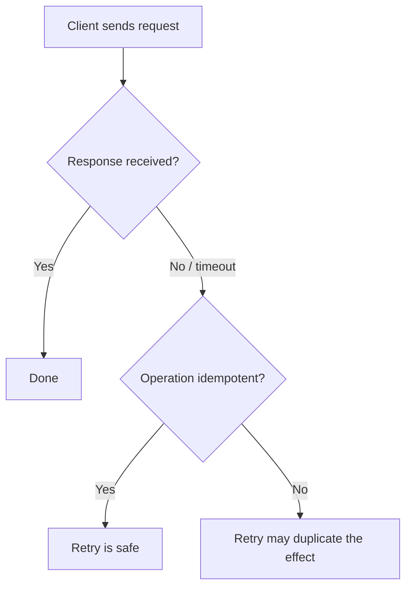

# Resource and operation design

Resource and operation design decides what an API exposes as nouns and what it exposes as verbs.

A resource is a thing the client can name and act on. An operation is an action the client can perform, with defined inputs, outputs, and effects.

The durable question is not which protocol style you use. It is which concepts the API names, and what each action promises about its effect.

## Resources: name the stable concepts

A resource should map to a concept the client cares about, with a stable identity. Good resources tend to be domain nouns: an account, an order, a document, a subscription.

Two guidelines keep resources stable:

- Model the domain concept, not the current storage layout. The API concept should survive a change to the internal schema.
- Give each resource a stable identifier that does not change when unrelated attributes change.

The representation a client receives is a view of the resource, not the resource itself. Keeping the two separate lets the server change internal state and still return a stable representation.

The canonical entities versus provider representations entry covers this separation in more depth.

## Operations: define the effect, not only the name

An operation needs three clear properties: what it reads, what it changes, and what it returns. Two properties from HTTP semantics apply to any operation, whatever the transport.

- Safe: the operation does not change observable server state. A client can call it freely, and a cache or crawler can call it without side effects.
- Idempotent: making the same call more than once has the same effect as making it once. The result the client sees may differ, but the server state does not drift with each retry.

These properties are not academic. A network client cannot always tell whether a failed call reached the server.

If the operation is idempotent, the client can retry safely. If it is not, a retry can duplicate the effect.

The diagram shows why idempotency is the property that makes a retry safe when the outcome is unknown.

## Map effects to method properties

When the API is over HTTP, align each operation with a method whose properties match the intended effect.

- A pure read is safe and idempotent.
- A full replacement of a known resource is idempotent: repeating it lands on the same final state.
- A delete of a known resource is idempotent in effect: after the first success the resource is gone.
- A create that generates a new identity on each call is not idempotent by default. Repeating it can create duplicates.

The reliability idempotency entry covers how to make an otherwise non-idempotent create safe, for example with a client-supplied idempotency key that the server records.

## Client and server responsibilities

The server defines each operation's effect and states its safe and idempotent properties in the contract. It must enforce those properties, not only document them.

The client chooses operations that match its intent and relies on the stated properties to decide what it can retry.

A client should not retry a non-idempotent operation without a mechanism that makes the retry safe.

## Trade-offs

Coarse operations that do more per call reduce round trips and lower latency for a full task.

They give the client less control and can force it to send or receive data it does not need.

Fine-grained operations are composable and precise. They can require many round trips for one user task, which raises latency and load. The pagination entry and the bounded work concept cover keeping each call's cost bounded.

A design that mirrors internal actions is quick to build. It tends to leak internal structure into the contract, which the compatibility entry shows is hard to change later.

## Common failure modes

- Modeling operations as remote procedure calls over internal functions, so the API changes every time the implementation does.
- Marking a read operation that has side effects. Caches, retries, and prefetch then trigger unwanted changes.
- Assuming a create is idempotent. A retried create with no idempotency key produces duplicate resources.
- Overloading one operation with a mode flag that changes its effect, so its safe and idempotent properties depend on the input.
- Returning different resource identities for the same underlying concept, which breaks client-side caching and references.

## Relationships to other boundaries

Operation semantics connect directly to reliability. Safe and idempotent properties are what let retries, timeouts, and at-least-once delivery stay correct. The idempotency, retries, and timeout entries build on the properties defined here.

Resource identity connects to performance. Stable identifiers make caching and conditional requests possible, which the caching and latency entries use to cut repeated work.

The error model is the other half of an operation's contract. The error modeling entry covers how an operation reports failure so a client can act on it.

## Sources

- Internet Engineering Task Force. "RFC 9110: HTTP Semantics." 2022.
- Roy T. Fielding. "Architectural Styles and the Design of Network-based Software Architectures." Doctoral dissertation, University of California, Irvine, 2000.
