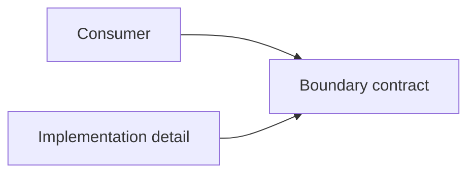

# Architecture boundaries and dependency direction

An architecture boundary separates responsibilities that should be understood, changed, or owned with limited knowledge of each other's implementation details.

A boundary has value only when it protects something. Common examples are a business capability, policy, data ownership rule, external integration, deployment unit, or security trust boundary.

Dependency direction determines which side is allowed to know about the other side's decisions.

The contract can be an interface, module API, protocol, event schema, data format, or another explicit agreement. The useful form depends on the boundary.

## Problem

Without deliberate boundaries, implementation details spread through the system. A change to one mechanism can then force unrelated changes in consumers.

Poor dependency direction can also make high-level policy depend directly on lower-level technology choices. The code compiles, but the architecture becomes difficult to change safely.

## Boundary design

A useful boundary normally answers three questions:

1. What responsibility or decision does this boundary protect?
2. What contract is visible across the boundary?
3. Which direction can dependencies cross?

A boundary should hide details that other parts do not need. It should expose enough information for collaboration without exporting its internal model by default.

## Dependency direction

Dependency direction should follow the engineering decision that needs protection.

A high-level policy can depend directly on a stable lower-level mechanism when that coupling is acceptable. Inversion is useful when the lower-level mechanism is replaceable and the policy should remain independent from it.

There is no universal rule that every dependency must point inward or toward an interface. The direction should preserve the intended boundary with the least necessary indirection.

## Suitable contexts

Explicit boundaries are useful when:

- responsibilities change for different reasons;
- one subsystem has clear data or invariant ownership;
- an external mechanism should remain replaceable;
- teams need a stable collaboration contract;
- deployment or security boundaries require controlled communication;
- uncontrolled coupling is making changes expensive.

## Trade-offs

Every boundary adds some cost. The cost can include APIs, adapters, data conversion, testing, versioning, latency, deployment coordination, or more code navigation.

A weak boundary can be worse than no boundary because it creates ceremony while internal details still leak across it.

A very strong boundary can also reduce useful cohesion if closely related behavior is split only to satisfy an architectural rule.

## Failure modes

Common problems include:

- a boundary exposes internal database tables or framework types;
- shared mutable state lets consumers bypass the contract;
- dependencies form cycles between modules;
- a shared library becomes an uncontrolled back door across boundaries;
- an interface exists, but both sides still depend on one concrete implementation model;
- teams create remote services for boundaries that only needed local modules.

## When a simpler alternative is preferable

A local function, type, or module can be enough when the responsibility is small and the coupling is acceptable.

Do not introduce a process boundary, network API, event stream, or abstraction layer unless it protects a decision that matters enough to justify the cost.

## Relationship to architecture styles

[Layered architecture](./layered-architecture/) applies dependency rules between responsibility layers.

[Modular monolith](./modular-monolith/) uses internal module boundaries while retaining one deployable application.

[Ports and Adapters](./ports-and-adapters/) protects application policy from external mechanisms through explicit ports.

[Event-driven architecture](./event-driven-architecture/) can decouple producers and consumers through event contracts, but it adds distributed coordination concerns.

[Separate concerns](../principles/separation-of-concerns/) explains when distinct responsibilities justify separation. [Invert dependencies around policy](../principles/dependency-inversion/) explains one important technique for controlling dependency direction.

## Sources

- David L. Parnas. "On the Criteria To Be Used in Decomposing Systems into Modules." *Communications of the ACM*, 1972.
- Robert C. Martin. *Agile Software Development: Principles, Patterns, and Practices*. Prentice Hall, 2002.
