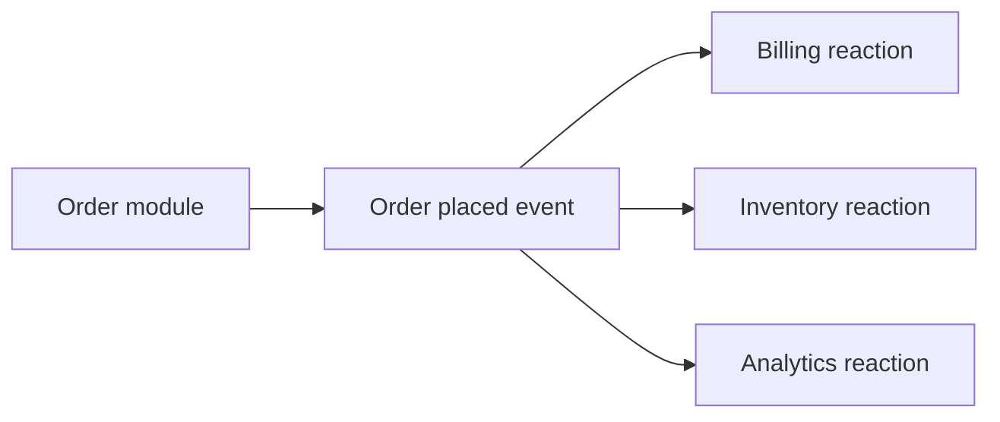

# Event-driven architecture

Event-driven architecture uses events to communicate that something significant happened. Other parts of the system can react without the producer directing each reaction.

An event normally records a fact such as `OrderPlaced` or `PaymentFailed`. It should not merely disguise a synchronous command.

The producer does not need to know every consumer. This can reduce direct coordination, but it moves complexity into delivery, consistency, observability, and failure handling.

## Problem

Direct request chains couple a producer to the availability, latency, and API of each downstream participant.

When several independent reactions can happen later, an event can separate the fact that occurred from the work that follows it.

## Core structure

A typical event-driven flow contains:

- a producer that records or emits an event;
- an event transport or durable log when asynchronous delivery is required;
- one or more consumers that react to the event;
- explicit handling for retries, duplicates, ordering, and failure where those properties matter.

The architecture must define delivery guarantees and ownership of event schemas. These are system contracts, not broker configuration details.

## Suitable contexts

Event-driven communication is useful when:

- several independent consumers react to the same fact;
- temporal decoupling is valuable;
- asynchronous processing is acceptable or desirable;
- workflows cross independently owned components;
- an audit or event history has domain value.

It can also support integration between systems that should not share a synchronous availability dependency.

## Trade-offs and operational costs

Events make control flow less visible than a direct function or request call. A business operation can span several consumers and complete over time.

Operational costs can include:

- message infrastructure or durable logs;
- retry and dead-letter handling;
- duplicate and out-of-order delivery handling;
- schema evolution and compatibility rules;
- distributed tracing and correlation;
- eventual consistency and reconciliation.

These costs exist even when a messaging platform hides some implementation details.

## Failure modes

Common problems include:

- using events for simple local calls that need an immediate result;
- publishing vague events that expose internal data instead of stable facts;
- assuming exactly-once processing without designing idempotent effects;
- creating long event chains that hide critical workflow logic;
- treating event order as guaranteed when the transport does not guarantee it;
- sharing one event schema as an uncontrolled integration database.

## When a simpler alternative is preferable

Use a direct call when one component needs an immediate result from another and the dependency is acceptable.

Use an in-process function call when all participants belong to one module and asynchronous delivery adds no useful independence.

A queue or event bus is not automatically an architectural improvement. Its value must justify the additional failure and operational model.

## Sources

- Gregor Hohpe and Bobby Woolf. *Enterprise Integration Patterns*. Addison-Wesley, 2003.
- Martin Fowler. "What do you mean by event-driven?" 2017.
