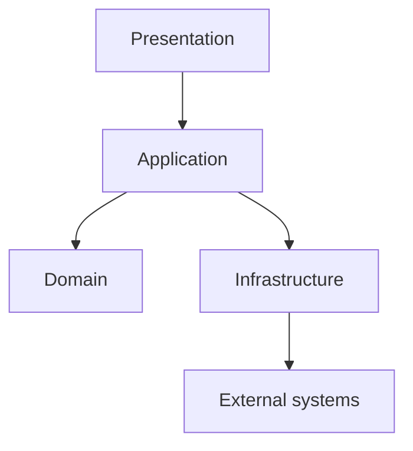

# Layered architecture

Layered architecture groups responsibilities into ordered layers. Each layer exposes a limited set of services to the layer above it.

The structure is useful when the system contains distinct responsibilities such as presentation, application coordination, domain policy, and infrastructure.

The exact layer names can change. The important property is that dependencies follow an explicit direction instead of crossing the system without control.

## Problem

Without clear responsibility boundaries, presentation code can depend directly on persistence details, business policy can depend on framework APIs, and unrelated changes can spread across the codebase.

A layered structure makes common dependency paths visible and gives each part of the system a narrower responsibility.

## Core structure

A layer should have a defined responsibility and a controlled public surface.

Common responsibilities include:

- presentation and input handling;
- application workflow and orchestration;
- domain policy and business rules;
- persistence and external integration.

A strict layered design allows dependencies only toward lower layers. A relaxed design can permit selected direct dependencies when they do not weaken an important boundary.

## Suitable contexts

Layering is often useful when:

- responsibilities have clear differences;
- the team benefits from predictable code placement;
- dependencies need an understandable default direction;
- the system does not require independent deployment of each responsibility.

It is especially useful as a simple starting structure for many business applications.

## Trade-offs

Layers add navigation and indirection. A request can pass through several types even when the behavior is simple.

A strict rule that every call must pass through every layer can create forwarding code with little value.

Layers can also become horizontal technical silos. A feature change can then require edits in many directories even when the feature itself is cohesive.

## Failure modes

Common problems include:

- presentation code bypasses the application boundary and queries persistence directly;
- domain policy imports framework or database types;
- layers contain only forwarding methods and no useful responsibility;
- a shared utility layer becomes an uncontrolled dependency target;
- layer rules are stated but not reflected in module boundaries or dependency checks.

## When a simpler alternative is preferable

A small application with limited behavior may only need a few cohesive modules and clear function boundaries.

Do not create several formal layers only to match a template. Add a layer when it owns a real responsibility or protects a useful dependency boundary.

## Sources

- Frank Buschmann, Regine Meunier, Hans Rohnert, Peter Sommerlad, and Michael Stal. *Pattern-Oriented Software Architecture, Volume 1: A System of Patterns*. Wiley, 1996.
- Martin Fowler. *Patterns of Enterprise Application Architecture*. Addison-Wesley, 2002.
