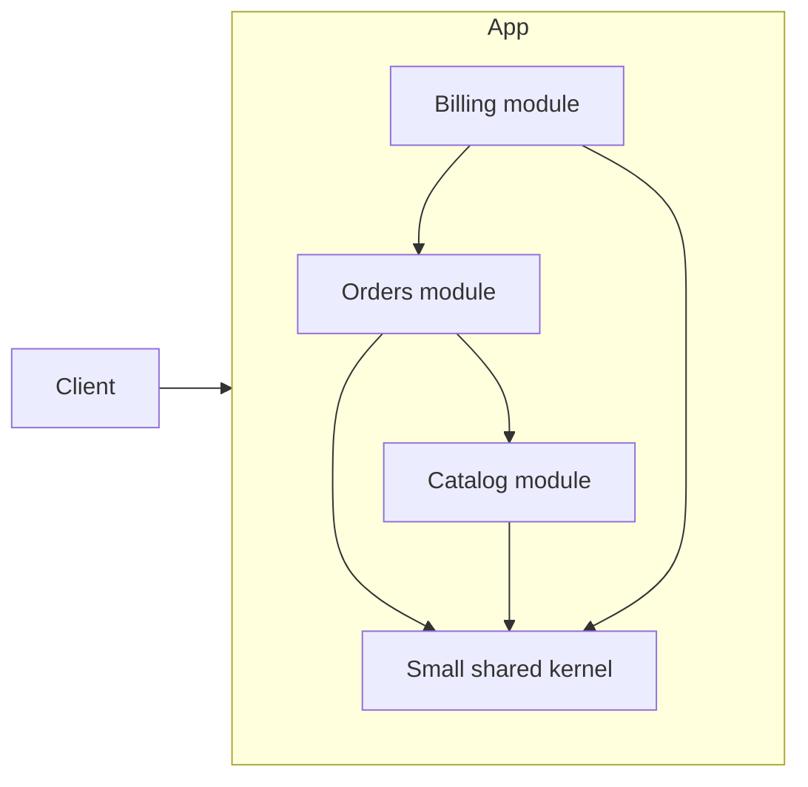

# Modular monolith

A modular monolith is one deployable application that contains explicit internal modules with controlled dependencies.

The deployment unit is monolithic. The internal design does not need to be.

The useful property is not the single process by itself. It is the combination of simple deployment and meaningful internal boundaries.

## Problem

A single application can become difficult to change when every feature depends on shared internals.

Splitting the system into network services can reduce some coupling. It also adds coordination, latency, failure, deployment, and observability costs.

A modular monolith addresses this trade-off by separating modules without requiring separate runtime services.

## Core structure

A module should own a cohesive capability or business responsibility. Other modules should depend on its public contract instead of its internal data structures.

Useful rules can include:

- module internals are private by default;
- cross-module calls use explicit public APIs;
- ownership of data and invariants is clear;
- cycles between modules are avoided;
- shared code remains small and intentional.

The exact enforcement mechanism depends on the language and build system.

## Suitable contexts

A modular monolith is often suitable when:

- one deployment unit is operationally sufficient;
- the domain has several distinct capabilities;
- independent service scaling is not yet required;
- the team wants clear ownership without distributed-system overhead;
- future extraction of some modules is possible but not certain.

## Trade-offs

Modules still share a runtime, release process, and usually one operational failure domain.

A bad internal dependency can spread quickly because the language and process often make direct access easy.

Large builds or releases can also affect unrelated modules unless tooling limits the cost.

## Failure modes

Common problems include:

- modules are directories only and do not restrict dependencies;
- modules read and write each other's internal persistence structures;
- a large shared library becomes the real center of the system;
- teams use internal events or interfaces as ceremony without reducing coupling;
- the monolith is split into services before stable boundaries are understood.

## When a simpler alternative is preferable

A small application may not need formal module boundaries. A few cohesive packages or namespaces can be enough.

Use stronger module rules when the cost of cross-feature coupling becomes material. Do not create a module for every small type or operation.

## Sources

- Martin Fowler. "Monolith First." 2015.
- David L. Parnas. "On the Criteria To Be Used in Decomposing Systems into Modules." *Communications of the ACM*, 1972.
