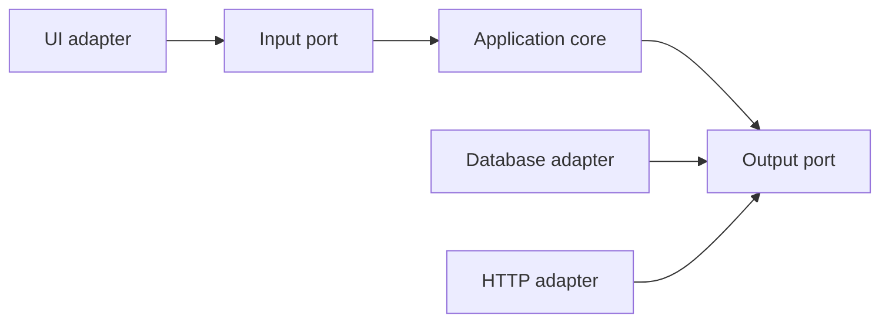

# Ports and Adapters

Ports and Adapters, also called Hexagonal Architecture, keeps application policy inside a boundary and connects external mechanisms through explicit ports.

A port describes an interaction the application accepts or requires. An adapter translates between that port and a concrete mechanism.

The essential distinction is between application policy and the outside mechanisms that drive or support it. The diagram shape is not a required physical layout.

## Problem

Applications often become coupled to delivery frameworks, databases, message brokers, or external APIs. Business policy then becomes difficult to test or reuse without those mechanisms.

Ports and Adapters puts a contract at each meaningful boundary so the application can express what it needs without owning the external implementation.

## Core structure and dependency rules

The application core owns its policy and its ports.

Driving adapters call input ports to request behavior. Driven adapters implement output ports that the application uses for persistence, messaging, external services, or other mechanisms.

Dependencies should point toward application-owned contracts when the boundary protects policy from replaceable infrastructure.

## Suitable contexts

This style is useful when:

- the domain policy should outlive a framework or integration choice;
- several delivery mechanisms need the same application behavior;
- external systems are replaceable or difficult to test directly;
- isolated application tests provide material value;
- dependency direction needs to protect a clear policy boundary.

## Trade-offs

Ports, adapters, and translation code add indirection. They also create contracts that need names, tests, and maintenance.

A port can become too generic and lose domain meaning. It can also mirror a low-level API so closely that it does not protect the application from change.

## Failure modes

Common problems include:

- creating an interface for every class instead of for meaningful boundaries;
- exposing database entities or framework request objects through application ports;
- placing business policy inside adapters;
- allowing the application core to import concrete infrastructure packages;
- treating the hexagon drawing as more important than dependency direction.

## When a simpler alternative is preferable

Direct integration is often clearer when the mechanism is small, stable, and does not threaten an important policy boundary.

Do not add a port only to make a simple dependency look architectural. Add one when it creates useful independence or makes an important contract explicit.

## Sources

- Alistair Cockburn. "Hexagonal Architecture." 2005.
