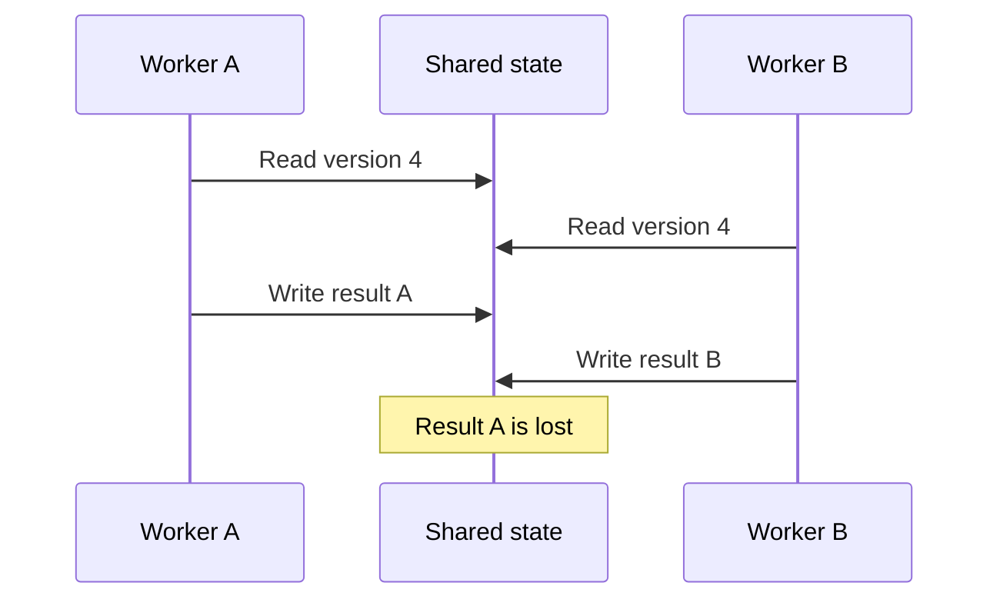

# Concurrent state transitions and lost updates

A concurrent state transition changes shared state while another actor can observe or change the same state.

Correctness depends on the invariant that the transition must preserve. A mechanism is useful only when it protects that invariant across all competing operations.

## Lost update

A lost update occurs when two actors read the same state, compute different results, and one write overwrites the other.

Each read and write can be individually valid. The read-modify-write transition is unsafe because nothing protects the state between the read and the write.

The [race condition](/dkkb/problems/race-condition/) entry treats unsafe timing as a failure mode. This entry focuses on the state transition that needs protection.

## Define the invariant first

State the property that must remain true before choosing a mechanism.

Examples include:

- a balance must not apply the same withdrawal twice;
- an inventory count must not lose a confirmed reservation;
- a workflow must move only from an allowed current state;
- one logical update must not overwrite another accepted update.

The invariant determines which operations conflict. Two writes to the same record do not always conflict if their effects commute or affect independent fields.

## Safety mechanisms

Common mechanisms include:

- mutual exclusion, which prevents conflicting work from entering one critical section at the same time;
- optimistic validation, which detects that the state changed before a write commits;
- atomic operations, which combine a read condition and state change into one indivisible operation;
- serialization through a queue or single owner, which gives one actor authority to order transitions;
- transactions, which protect persistence invariants across a defined database boundary.

The correct mechanism must cover the full transition. Protecting only one statement leaves the gap between statements exposed.

## Stale decisions

A stale decision uses state that was valid when read but no longer matches the state when the action executes.

A version check can reject the stale action. A lock can prevent the state from changing during the decision. A design can also recompute the decision from fresh state.

Do not retry a rejected stale action blindly. The new state can require a different result.

## Idempotency is different

Idempotency makes repeated delivery of the same logical operation safe. It does not prevent two different valid operations from overwriting each other.

Use [idempotency](/dkkb/reliability/idempotency/) for duplicate delivery. Use concurrency control when distinct operations compete over one invariant.

## Trade-offs

Stronger serialization can simplify reasoning but reduce concurrency and increase latency under contention.

Optimistic techniques allow more parallel work but can waste work when conflicts are frequent. Retry cost then becomes part of the design.

A single owner can remove many shared-memory conflicts, but it can create a throughput or availability boundary.

## Failure modes

Common failures include:

- check-then-act code where the check and update are not atomic;
- a version check that protects one record while the invariant spans several records;
- retry logic that reapplies a stale decision;
- a lock that protects one process while another writer bypasses it;
- duplicate work that is mistaken for a lost update problem.

## Practical guidance

Identify the shared state, the competing operations, and the invariant they can violate.

Then choose the smallest mechanism that makes the complete transition safe. Measure contention and retry behavior rather than assuming one concurrency strategy fits every workload.
