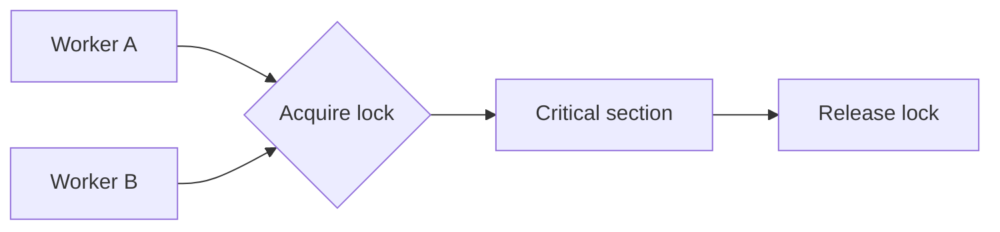

# Locks, mutexes, and critical sections

A [critical section](../glossary/critical-section.md) is code that accesses shared state under a mutual-exclusion rule.

A lock or [mutex](../glossary/mutex.md) grants one holder authority to enter that section while conflicting actors wait or fail to acquire the same protection.

## Safety property

Mutual exclusion provides safety only when every conflicting operation uses the same lock boundary.

The lock does not protect a variable by itself. The program protects an invariant by requiring all relevant transitions to obey the same synchronization rule.

## Keep the critical section narrow

Hold a lock for the state transition that must be atomic.

A larger critical section can simplify correctness, but it increases contention and wait time. A smaller section can improve concurrency, but it is unsafe if part of the invariant remains outside the lock.

Do not hold a local lock across slow network calls or user interaction unless the design explicitly accepts the blocking and failure behavior.

## Lock ordering

[Deadlock](../glossary/deadlock.md) can occur when two actors hold different locks and each waits for the other lock.

A consistent global acquisition order can remove this cycle for a known lock set. Another option is to avoid holding several locks at once.

Timeouts can bound waiting, but a timeout does not repair partially completed work or prove that the invariant is safe.

## Liveness

Mutual exclusion protects safety but can harm liveness.

Common liveness risks include:

- deadlock, where participants wait on each other indefinitely;
- starvation, where one participant repeatedly loses access to the protected resource;
- convoying, where slow lock holders delay otherwise independent work;
- priority inversion, where a high-priority actor waits behind lower-priority work.

A correct lock design must consider both the protected invariant and the progress properties required by the system.

## Reentrancy and hidden lock scope

A reentrant lock lets the same execution context acquire the lock again. This can avoid self-deadlock in some call graphs, but it can also hide broad lock scope.

Prefer explicit ownership and short critical sections over relying on reentrancy to make deeply nested locking safe.

## Locks and databases

Database locks protect data inside database concurrency-control rules. Application mutexes protect state visible to one application boundary.

One does not automatically replace the other. A process-local mutex cannot protect a row from another process that writes directly to the database.

The [optimistic versus pessimistic concurrency control](/dkkb/databases/optimistic-vs-pessimistic-concurrency-control/) entry covers the database decision.

## Locks and distributed systems

A process mutex assumes one shared synchronization authority. Distributed coordination has failures that local locking does not have, including lease expiry, network partition, and stale owners.

Do not treat a remote lock service as a larger mutex without defining the failure protocol. See [distributed coordination and coordination avoidance](/dkkb/concurrency/distributed-coordination-and-coordination-avoidance/).

## Trade-offs

Locks are direct and often easy to reason about for one shared-memory boundary. Under contention, they reduce parallelism and can increase tail latency.

Fine-grained locking can improve concurrency but increases lock-ordering complexity. Coarse locking simplifies the dependency graph but serializes more work.

Use the coarsest lock that meets performance needs while keeping the invariant and lock order understandable.
