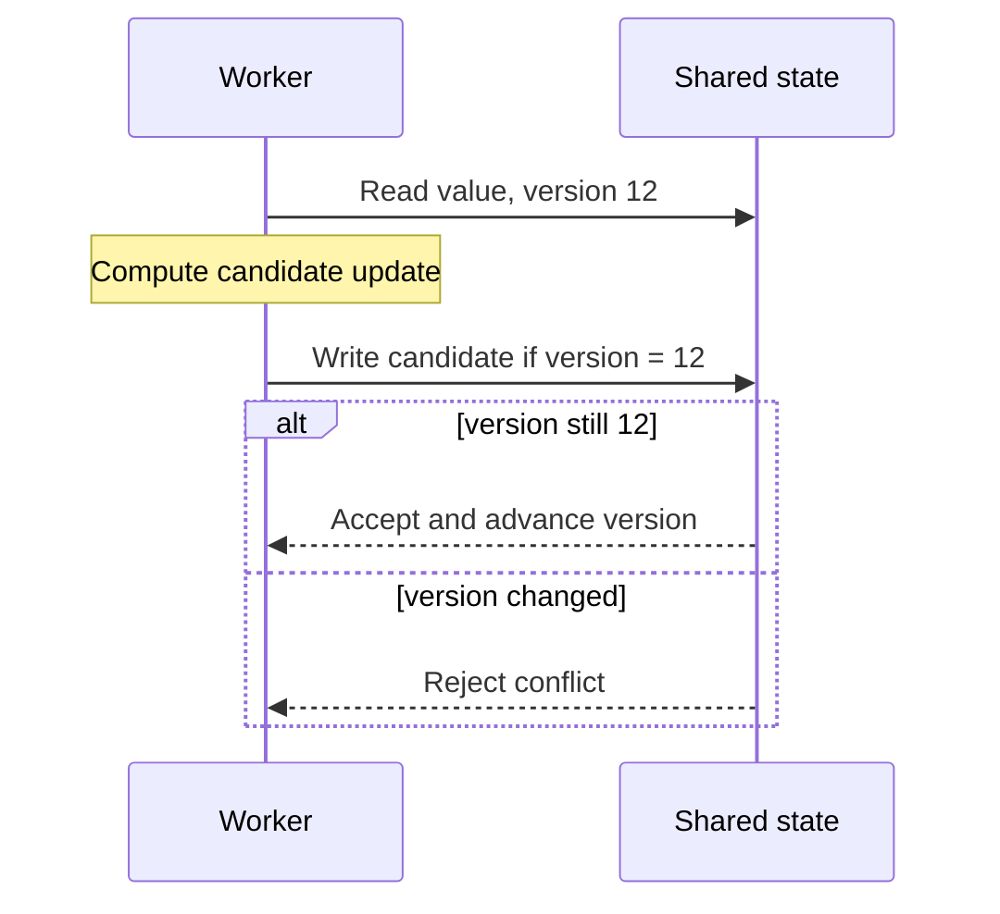

# Optimistic concurrency and compare-and-set

Optimistic concurrency lets actors work without exclusive ownership and detects a conflict before accepting the final state change.

Compare-and-set is the core shape: change a value only if the current value still equals the expected value.

## Versioned update

A version token makes stale state explicit.

The final conditional write must be atomic. A separate check followed by an unconditional write recreates the race.

## What the version protects

The version must represent the state used by the decision.

If an invariant spans several values, checking only one unrelated version can accept a decision based on stale data. The validation boundary must cover the full state that can invalidate the update.

A monotonically changing version is often safer than comparing only a value that can change away and later return to the same representation.

## Conflict handling

A conflict means the assumption used by the actor is no longer current.

The caller can:

- reload the state and recompute;
- return a conflict to a user or upstream service;
- merge independent changes when the domain defines a safe merge;
- abandon the operation.

Do not automatically repeat an external side effect only because the state write conflicted.

## Compare-and-set and locks

Locks prevent a conflicting transition from entering the protected section. Compare-and-set allows competing work and chooses which update is accepted.

Optimistic techniques work well when contention is low and retry work is cheap. Locks can be better when conflicts are common or recomputation is expensive.

The database-specific trade-off is covered by [optimistic versus pessimistic concurrency control](/dkkb/databases/optimistic-vs-pessimistic-concurrency-control/).

## Retry safety

A retry must use fresh state and preserve side-effect semantics.

If work before the compare-and-set already sent a message, charged a payment, or changed another system, retrying the full operation can duplicate the effect.

Use [idempotency](/dkkb/reliability/idempotency/) when repeated delivery is possible. Keep irreversible side effects after the accepted state transition when the workflow permits it.

## Contention

Optimistic concurrency does not remove contention. It changes contention from waiting into failed attempts and retries.

Measure conflict rate, wasted work, and retry latency. A hot shared record can make optimistic concurrency slower and less predictable than serialization.

## Failure modes

Common failures include:

- checking a version in one operation and writing in another non-atomic operation;
- retrying with the original stale decision instead of recomputing;
- protecting one field when the invariant spans several fields;
- using a token that can repeat and accepting an old state as current;
- repeating external side effects after a conflict;
- hiding repeated conflicts behind unlimited retries.

## Practical guidance

Use optimistic concurrency when conflicts are expected to be uncommon and the system can reject or safely recompute stale work.

Use an atomic expected-state check at the acceptance boundary. Treat a conflict as new information, not as a transient error that always deserves the same retry.
