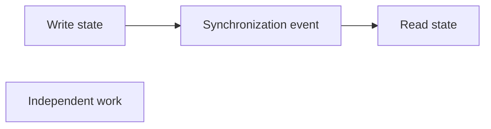

# Ordering, happens-before, and visibility

Concurrent operations need an ordering guarantee when one action depends on the effects of another action.

Happens-before is a partial-order relation used to state that one action must be ordered before another for correctness.

## Partial order

Not every pair of concurrent actions needs a defined order.

The write must be ordered before the read when the read depends on that value. Independent work can remain unordered.

This distinction preserves concurrency while making required dependencies explicit.

## Visibility

An actor can execute after another actor in wall-clock time without being guaranteed to observe its state change.

Synchronization mechanisms establish both an ordering relation and the visibility rules required by their contract. Examples include lock release followed by lock acquisition, atomic synchronization operations, or message delivery through a defined channel.

The exact memory rules differ by runtime and processor. DKKB keeps this entry at the mechanism level rather than specifying one language memory model.

## Program order is not global order

Each actor has a local sequence of actions. Concurrent actors do not automatically share one global execution order.

A scheduler, processor, compiler, network, or storage layer can expose behavior that differs from a simple line-by-line mental model unless the program uses a required synchronization boundary.

Do not infer a concurrency guarantee from source-code position alone when another actor observes the state.

## Messages and causal order

A message can establish a causal relationship: sending happens before receiving that specific message.

This does not mean all messages across a distributed system have one total order. Independent messages can arrive in different orders at different consumers unless the protocol defines stronger ordering.

Event-driven systems should state whether consumers need per-key ordering, causal ordering, total ordering, or no ordering guarantee beyond delivery.

## Clocks are evidence, not synchronization

Wall-clock timestamps help with observability and business time. They do not by themselves establish a safe concurrency order.

Clock skew, timestamp resolution, and independent writers can make two events difficult to order reliably. Use an ordering or version protocol when correctness depends on which state transition wins.

## Failure modes

Common failures include:

- assuming a write is visible because another actor runs later;
- relying on timestamps as a unique total order;
- expecting FIFO behavior from a channel that does not promise it;
- publishing a signal before the state it describes is visible;
- using synchronization for one variable while the invariant also depends on unprotected state.

## Trade-offs

Stronger ordering can reduce concurrency, require coordination, or add buffering and latency.

Weak ordering allows more independent progress but moves complexity to consumers that must tolerate reordering or stale state.

Specify only the ordering required by the invariant. A total order is expensive and often unnecessary when a per-entity or causal order is enough.
