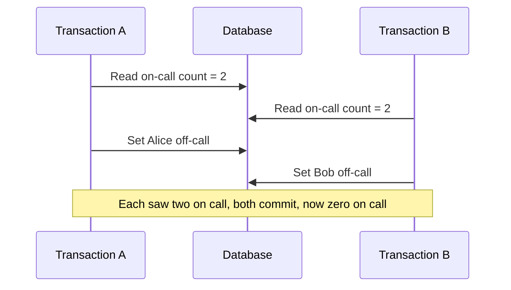

# Isolation levels and concurrency anomalies

An isolation level defines how much of one transaction's uncommitted or concurrent work another transaction can observe.

A weaker level allows more concurrency and more anomalies. A stronger level prevents more anomalies at a higher coordination cost.

The problem being managed is interference. When transactions run at the same time, their reads and writes interleave. Some interleavings produce results that no serial order of the same transactions could produce.

## The anomalies

The SQL standard defines isolation levels by which phenomena they prevent. The core read anomalies are:

- Dirty read: a transaction reads a row written by another transaction that has not committed. If that other transaction rolls back, the read used data that never existed.
- Non-repeatable read: a transaction reads a row twice and gets different committed values because another transaction changed the row in between.
- Phantom read: a transaction runs the same predicate query twice and the second run returns rows that a concurrent transaction inserted or removed.

Two write anomalies matter for correctness but are not fully described by the classic read phenomena:

- Lost update: two transactions read the same value, each computes a new value from it, and one write overwrites the other. The race condition entry covers this class of failure.
- Write skew: two transactions each read an overlapping set, confirm a rule holds, and each writes a different row. Both writes are valid alone, but together they break the rule.

The diagram shows write skew. Neither transaction saw the other's write, so each believed its own change was safe.

## The mechanism at a product-neutral level

Two families of mechanism implement isolation.

Lock-based systems make a transaction acquire read or write locks and hold them until commit. Holding all locks to the end (two-phase locking) can produce serializable behavior. Locks reduce concurrency and can deadlock.

Multi-version systems keep several committed versions of a row. A reader sees a consistent snapshot taken at a point in time and does not block writers.

Snapshot isolation prevents dirty reads, non-repeatable reads, and many phantoms, but it still allows write skew unless the system adds extra checks.

## The standard levels

From weakest to strongest, the SQL levels are Read Uncommitted, Read Committed, Repeatable Read, and Serializable. Each level is defined by the anomalies it forbids, not by a specific implementation.

A given database may implement a level more strictly than the standard requires.

Serializable is the strongest level: the result must equal some serial execution of the same transactions. It removes the anomalies above but costs the most in coordination, aborts, or blocking.

:::caution[The same level name can mean different guarantees]
Isolation levels are named by the phenomena they must prevent, so two databases can implement one level differently. Read your database's documentation for the exact guarantee, not only the level name.
:::

## Trade-offs

A weaker level allows more transactions to proceed without waiting, which raises throughput and lowers latency. It also exposes more anomalies that the application must either tolerate or prevent by hand.

A stronger level removes anomalies but increases blocking, abort-and-retry rates, or deadlock. Under contention, serializable execution can lower throughput sharply.

The right level depends on the invariant. A read that only informs a human dashboard can tolerate a weaker level. A read that decides whether to allow a withdrawal cannot.

## Common failure modes and misleading assumptions

- Assuming the default level is serializable. Many databases default to Read Committed, which still allows non-repeatable reads and lost updates.
- Assuming snapshot isolation is serializable. It prevents most read anomalies but allows write skew.
- Fixing a lost update by raising the isolation level without testing. The chosen level may still allow the specific interleaving.
- Treating a read-then-write sequence as safe because each statement is atomic. The gap between the read and the write is where the anomaly lives.

## Interaction with application and distributed boundaries

Isolation levels describe transactions inside one database. A read replica adds a separate concern: replication lag can serve a committed value that is older than the primary, which the application sees as a stale read.

The caching entry covers reasoning about staleness bounds.

Across services, no shared isolation level exists. Each service isolates its own transactions, and the interaction between them needs an explicit protocol, not an isolation setting.

When an anomaly is possible at the chosen level, the application can prevent it directly with a version check or an explicit lock. The optimistic versus pessimistic concurrency control entry covers that choice.

## Sources

- Hal Berenson, Phil Bernstein, Jim Gray, Jim Melton, Elizabeth O'Neil, and Patrick O'Neil. "A Critique of ANSI SQL Isolation Levels." *ACM SIGMOD*, 1995.
- The PostgreSQL Global Development Group. "Transaction Isolation." *PostgreSQL Documentation*.
