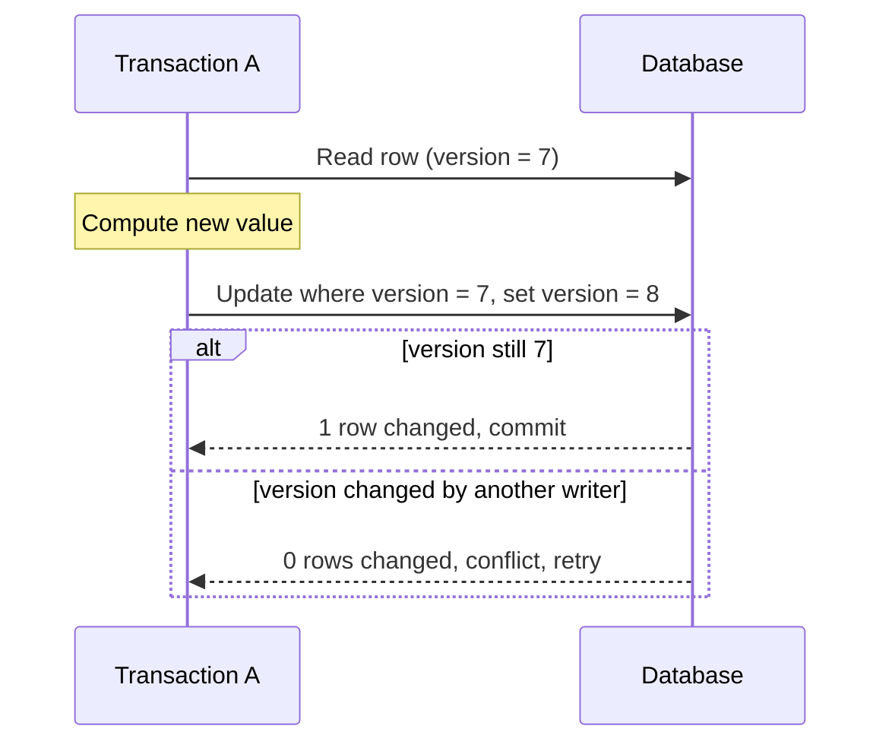

# Optimistic versus pessimistic concurrency control

Concurrency control protects an invariant when two transactions try to change the same data at the same time. The two families differ in when they handle a conflict.

Pessimistic control prevents a conflict: a transaction takes a lock before it works, so no one else can interfere.

Optimistic control allows the work to proceed and detects a conflict at commit: if the data changed underneath, the commit fails and the caller retries.

The invariant protected is the same in both cases. It is most often the prevention of a lost update, where two transactions read a value and one overwrites the other's change.

The race condition entry covers this failure.

## The mechanism at a product-neutral level

Pessimistic control uses locks. A transaction acquires a read or write lock on the data it touches and holds it until commit. While the lock is held, conflicting transactions wait.

Holding all locks until the end (two-phase locking) is a standard way to reach serializable behavior.

Optimistic control uses validation. Each row carries a version marker, such as a version number or a timestamp.

A transaction reads the version, does its work, and on commit writes only if the stored version still matches the one it read. A conditional update expresses this as a single atomic compare-and-set.

## Options

### Pessimistic

Lock the data before working with it.

Favor this under high contention, when conflicts are frequent, or when a retry is expensive or hard to make safe.

It also fits when the work between read and write is long and you cannot afford to repeat it.

### Optimistic

Let the work proceed and validate at commit.

Favor this under low contention, when conflicts are rare, or when holding a lock would be costly or would span a user's think-time.

It also fits when the transaction reads from data the caller cannot lock, such as a stateless request that reads and then writes later.

## Trade-offs

- Under low contention, optimistic control wins: no locking overhead, and the rare conflict costs one retry. Under high contention, its retry rate climbs and can waste work.
- Under high contention, pessimistic control serializes access cleanly, but locks reduce concurrency and can produce deadlock and lock waits.
- Optimistic control needs a safe retry. The retried transaction must be idempotent or must recompute from the fresh state. The idempotency and retries and exponential backoff entries cover safe retry behavior.
- Pessimistic control needs careful lock scope and ordering. A lock held too long or acquired in an inconsistent order causes contention or deadlock.

:::caution[A retry must not repeat the effect]
Optimistic control assumes a failed commit can be retried safely. Before you choose it, confirm the operation is idempotent or recomputes its result from the current state. A blind retry can duplicate an effect.
:::

## Common failure modes and misleading assumptions

- Choosing optimistic control for hot data. Frequent conflicts turn most attempts into retries, which wastes work and adds latency.
- Choosing pessimistic control across a network call or user think-time. The lock is held while the transaction waits, which starves other work.
- Assuming a read-then-write is safe because each statement is atomic. The gap between the read and the write is where the lost update happens, unless a version check or a lock covers it.
- Retrying an optimistic conflict without recomputing from the fresh value, which reapplies a stale decision.

## Interaction with application and distributed boundaries

Isolation levels and concurrency control interact. A weaker isolation level leaves anomalies that the application must prevent itself, often with an explicit version check or lock.

The isolation levels and concurrency anomalies entry covers those levels.

Some conflicts span more than one request or one transaction: a user reads a record on one request and saves it much later. A database lock cannot span that gap cheaply.

An application-level version marker carried through the requests lets the final write detect that the record changed in between. This is optimistic control applied at the application boundary rather than inside one transaction.

Across services, neither locks nor a shared version marker exist automatically. The conflict must be handled with an explicit protocol, and the safe-retry requirement becomes central.

The transactions and consistency boundaries entry covers why one transaction cannot span services.

## Conditions that favor each option

Prefer optimistic control when contention is low, retries are safe and cheap, or the conflict spans requests that cannot hold a lock.

Prefer pessimistic control when contention is high, a conflict is likely, or repeating the work would be expensive or unsafe.

Measure the real conflict rate before committing to one. Contention is an empirical property of the workload, not a fixed property of the data.

## Sources

- H. T. Kung and John T. Robinson. "On Optimistic Methods for Concurrency Control." *ACM Transactions on Database Systems*, 1981.
- Kapali Eswaran, Jim Gray, Raymond Lorie, and Irving Traiger. "The Notions of Consistency and Predicate Locks in a Database System." *Communications of the ACM*, 1976.
- Martin Fowler. "Optimistic Offline Lock." *Patterns of Enterprise Application Architecture*.
