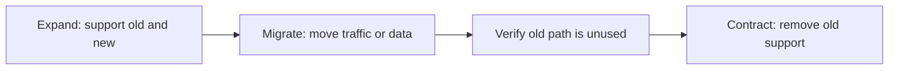

# Backward-compatible deployment and expand-contract changes

A backward-compatible deployment lets old and new software coexist during the period when a system cannot switch every participant atomically.

Expand-contract is a staged change pattern: add the new capability, move users to it, then remove the old capability.

## Why coexistence matters

A rolling or distributed deployment can have several versions active at the same time.

Queues can retain messages produced by an older version. Clients can update later than servers. Database readers can remain on an old schema while a new writer is already deployed.

The compatibility window must cover these mixed states.

## Expand, migrate, contract

### Expand

Add the new field, endpoint, schema element, or behavior without removing the old contract.

New writers should avoid producing data that old readers cannot tolerate unless those readers have already left the compatibility window.

### Migrate

Move traffic, data, or callers to the new contract while both forms remain supported.

Measure adoption and correctness. Do not infer completion only from elapsed time.

### Contract

Remove the old contract after evidence shows that no required participant still depends on it.

The removal is a separate change because it changes compatibility risk.

## Database migrations

Database expand-contract changes often need backfill, dual writes, readiness checks, and controlled read cutover.

The [safe online data migrations](/dkkb/practices/safe-online-data-migrations/) entry owns those data-migration details. This entry focuses on the wider deployment compatibility window.

## API and message contracts

For APIs and messages, compatibility depends on what old consumers do with new or missing fields and how new consumers handle old producers.

Additive changes are not automatically safe. A new enum value, stricter validation, or changed semantic meaning can break an old consumer even when the serialized shape still parses.

Use the [API contracts and compatibility](/dkkb/api-design/api-contracts-and-compatibility/) entry to reason about observable contract changes.

## Rollback window

Backward compatibility can preserve rollback by keeping the old software able to read state written by the new software.

If a new deployment writes an irreversible representation that the old version cannot read, application rollback can fail even when the old binary is still available.

Plan the rollback window before the expand step. When rollback is impossible, prefer a tested roll-forward path and make the irreversible boundary explicit.

## Failure modes

Common failures include:

- removing the old field in the same release that introduces the new one;
- changing writers before old readers can tolerate the new representation;
- assuming an additive schema change is semantically compatible;
- contracting based on a calendar date without usage evidence;
- keeping dual behavior forever because no removal condition exists;
- claiming rollback support after data has become unreadable by the old version.

## Trade-offs

Staged compatibility increases temporary code paths, tests, and operational states.

An atomic cutover can be simpler when the system can stop all participants safely. Expand-contract is valuable when availability or independent deployment makes an atomic switch impractical.

## Practical guidance

Define which old and new versions can coexist and for how long.

Expand first, migrate with evidence, and contract only after the old contract is no longer required. Keep rollback compatibility explicit throughout the window.
