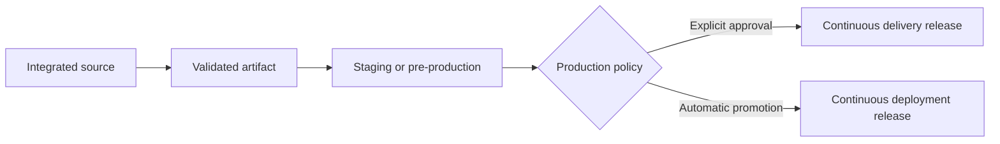

# Continuous delivery versus continuous deployment

Continuous delivery keeps every accepted change in a state that can be promoted to production through a repeatable process.

Continuous deployment adds automatic production promotion after the required gates pass.

The difference is the final production decision, not the quality standard applied before it.

## Continuous delivery

A validated artifact waits for an explicit production promotion decision.

This can fit products that need coordinated launch timing, legal approval, business scheduling, customer communication, or a deliberate release window.

The manual decision should select an already validated artifact. It should not start a separate manual build that creates a new unvalidated state.

## Continuous deployment

A validated change advances to production automatically when the promotion policy allows it.

This reduces queue time between integration and production. It also requires strong automated gates, observability, and recovery because production changes happen more frequently with less manual ceremony.

## One artifact through promotion

Both models are safer when the same built artifact moves through environments.

Rebuilding for each environment weakens the evidence because production receives a different artifact from the one already tested.

Environment-specific configuration can still change. Treat that configuration as part of the promotion contract.

## Promotion evidence

Before production, define the evidence required for the system's risk level.

This can include:

- required CI quality gates;
- deployment-package validation;
- compatibility checks;
- security controls;
- canary or limited-rollout health;
- release-specific business or policy approval.

Continuous deployment does not remove approval requirements that are intrinsic to the product. It automates only the decisions that the organization can safely encode as policy.

## Trade-offs

Continuous delivery preserves an explicit release point but can accumulate validated changes in a queue. Large batches can then increase release risk.

Continuous deployment reduces batch size and lead time, but it increases the importance of reliable automation and fast detection of bad changes.

Both models can fail if deployment is rare, manual, and difficult to reproduce. The label matters less than whether promotion is routine and recoverable.

## Release versus deployment

Deployment changes running software or configuration. Release changes which capability users can access.

Feature flags can separate these events. Code can be deployed continuously while a product capability remains disabled until a later release decision.

See [feature flags and controlled rollout](/dkkb/delivery/feature-flags-and-controlled-rollout/).

## Failure modes

Common failures include:

- calling a manual, fragile release process continuous delivery because CI is automated;
- calling every automatic deployment safe without strong production verification;
- rebuilding after approval and invalidating prior evidence;
- accumulating many validated changes before a manual release, which recreates a large batch;
- using deployment frequency as a goal without measuring change failure and recovery.

## Decision guidance

Favor continuous delivery when production timing needs an explicit decision that cannot or should not be automated.

Favor continuous deployment when the promotion policy can be encoded safely and the system can detect and recover from bad releases quickly.

In both cases, keep artifacts reproducible, promotion evidence explicit, and recovery routine.
