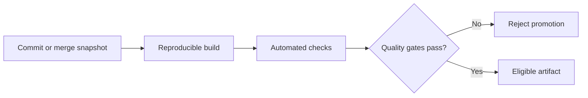

# Continuous integration and quality gates

Continuous integration keeps changes close to a shared mainline and validates each integrated state with automated evidence.

A quality gate is a promotion rule. The change cannot advance until the required evidence passes for the state being promoted.

## Integrate small states

Frequent integration reduces the time that branches can diverge from each other.

Small integrated states are easier to review, validate, and diagnose than large batches that combine many unrelated changes.

Continuous integration does not require one branching model. It requires a short path from local work to a shared validated state.

## Bind evidence to one snapshot

Validation must describe the exact source or artifact that will advance.

If the source changes after validation, the previous result is stale for checks affected by the change.

Re-run the relevant pipeline rather than combining evidence from different snapshots.

## Quality gates

Useful gates represent properties that the project requires before promotion.

Examples include:

- build and static analysis;
- deterministic unit and integration tests;
- contract or schema validation;
- security and dependency checks;
- documentation and content validation;
- packaging or deployment dry runs.

A gate should have a defined failure meaning. Adding every available checker can increase cost without increasing useful confidence.

## Reproducibility

A pipeline should control the tools and dependencies that affect its result.

Pin important runtime and action versions. Use locked dependencies. Keep environment assumptions in version control when practical.

A validation that depends on one developer machine is weak promotion evidence because another environment can produce a different result.

## Fast feedback and depth

Fast checks should run early because they reject bad states cheaply.

Slower checks can run later when they protect properties that cannot be validated quickly. Keep the required gate set proportional to the release risk.

Path-aware validation can reduce unnecessary work, but the selection rule becomes part of the correctness boundary. A missed dependency can skip a required check.

## Flaky checks

A flaky required check weakens the gate because teams learn to rerun it until it passes.

Fix, quarantine, or replace nondeterministic checks. Do not treat repeated execution as evidence that the underlying state is correct.

The [deterministic tests](/dkkb/testing/deterministic-tests/) entry covers this failure mode in detail.

## Environment drift

Passing CI does not prove production equivalence when deployment environments differ in runtime, configuration, permissions, data, or infrastructure.

Reduce drift through reproducible artifacts and explicit environment configuration. Validate environment-specific behavior at the promotion stage that can observe it.

## Failure modes

Common failures include:

- long-lived branches that integrate only after assumptions have diverged;
- gates that pass on a commit different from the one merged or deployed;
- dependency installation without a lock or controlled version;
- flaky tests that become accepted noise;
- a green pipeline that omits a required production property;
- manual release steps that rebuild an artifact after validation.

## Practical guidance

Define the smallest required evidence set that makes an integrated snapshot eligible for the next stage.

Keep the build reproducible, keep feedback fast enough to be used consistently, and make every required gate describe the same promotable state.
