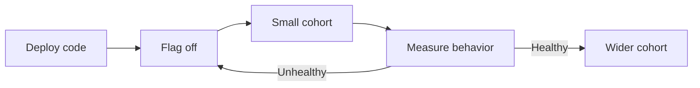

# Feature flags and controlled rollout

A [feature flag](../glossary/feature-flag.md) selects behavior at runtime without requiring a new deployment for every enable or disable decision.

Flags can separate code deployment from product release and can limit exposure while production evidence is collected.

## Define the flag purpose

Different flag purposes have different lifetimes and risk.

Common purposes include:

- release flags for incomplete or not-yet-released behavior;
- operational flags for disabling an expensive or risky path;
- experiment flags for assigning populations to alternatives;
- entitlement flags for stable permission or product rules.

Do not manage every purpose with the same lifecycle policy. A temporary release flag should normally have a removal condition. A stable entitlement rule can be part of the domain model instead of temporary rollout debt.

## Safe defaults

Define what happens when the flag system is unavailable or the flag value is missing.

Choose the default from the risk of the behavior. A security or destructive capability should not silently enable because configuration is uncertain.

The fallback policy belongs in code and tests, not only in an operator runbook.

## Controlled rollout

A rollout can increase exposure by percentage, cohort, region, account, or another stable boundary.

The cohort rule must be deterministic enough that analysis can identify which population received the behavior.

Use observability that compares the relevant outcome between exposed and unexposed traffic when practical.

## Testing flag states

Every flag increases the number of possible runtime states.

Test the states that matter to the transition:

- default state;
- enabled state;
- disabled or fallback state;
- migration boundary when old and new behavior coexist.

Do not attempt every mathematical combination when many independent flags exist. Instead, reduce flag count and test combinations that can interact over one invariant.

## Flag debt

A temporary flag becomes debt when its rollout is complete but both paths remain indefinitely.

Old branches keep tests, configuration, telemetry, and mental overhead alive. They can also preserve code paths that no longer receive normal production exercise.

Give temporary flags an owner and removal condition. Remove the old path after the compatibility or observation window ends.

## Operational flags

A kill switch can reduce impact quickly when a feature has a safe disabled mode.

Do not treat a flag as a universal rollback mechanism. A disabled code path cannot reverse an already applied data migration, external side effect, or incompatible contract change.

## Failure modes

Common failures include:

- flag evaluation fails open for a risky feature;
- a temporary flag becomes permanent without ownership;
- a flag changes a data contract while old and new consumers still coexist;
- rollout cohorts are unstable, which makes measurement hard to interpret;
- disabled code is never tested and fails when needed during an incident;
- many flags combine into states no team understands.

## Practical guidance

Use a feature flag when runtime control has a clear release, experiment, operational, or entitlement purpose.

Define its default, owner, rollout evidence, failure behavior, and removal condition before deployment. Remove temporary flags after their transition ends.
