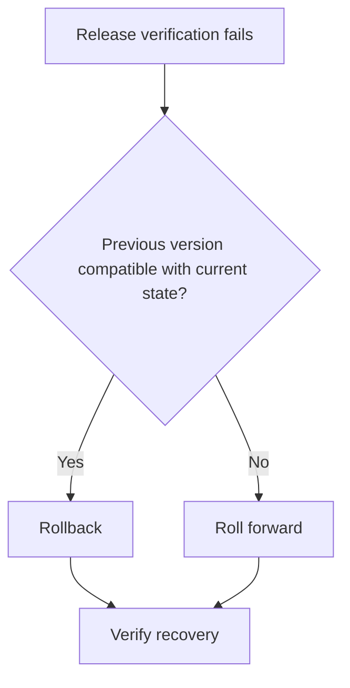

# Rollback, roll-forward, and release verification

Release verification checks whether the deployed production state satisfies the conditions that justified promotion.

A recovery plan decides what to do when that evidence fails after deployment.

## Verify the production state

Deployment success means the deployment mechanism completed. It does not prove that the service behaves correctly for users.

Verify properties that can only be known after promotion, such as:

- process or instance health;
- request success and latency;
- critical user journeys;
- error and saturation changes;
- dependency behavior;
- data or message compatibility;
- required service-level indicators.

Use a bounded observation window that matches how quickly the failure mode can appear.

## Rollback

Rollback restores a previous known-good software or configuration state.

Rollback is strong when:

- the previous artifact is still deployable;
- data written by the new version remains readable by the old version;
- external effects do not need to be undone;
- rollback itself is automated and tested.

A rollback command that has never been exercised is a hypothesis, not a recovery guarantee.

## Roll-forward

Roll-forward deploys a corrective change instead of restoring the previous version.

It is often necessary after an irreversible migration, contract change, or external side effect. It can also be faster when the defect is small and the old version cannot safely consume the current state.

Roll-forward requires a build and validation path that remains usable during an incident. Do not bypass every gate without defining which evidence is still required for an emergency fix.

## Choose before the incident

Classify changes by reversibility before deployment.

If rollback depends on data compatibility, preserve that compatibility window through staged changes.

See [backward-compatible deployment and expand-contract changes](/dkkb/delivery/backward-compatible-deployment-and-expand-contract/).

## Canary and limited rollout

A canary limits the first exposure of a release so production evidence arrives before every user receives the change.

Define the comparison and abort criteria before rollout. A canary without a decision rule can delay failure detection while still allowing the rollout to continue.

The canary population must be representative enough to exercise the relevant failure mode.

## Artifact identity

Record which artifact, configuration, migration state, and feature-flag state produced the observed behavior.

Without this identity, an operator can compare metrics from different states and draw the wrong conclusion about a release.

## Failure modes

Common failures include:

- treating deployment completion as release verification;
- rolling back code after an incompatible data change;
- rebuilding the old release instead of using the known artifact;
- waiting for broad user impact before checking a canary;
- using one global average that hides a failing population;
- choosing roll-forward during an incident when the build path is slow or unreliable;
- changing several rollout variables before measuring the effect of one recovery action.

## Trade-offs

Rollback is fast when compatibility is preserved, but maintaining reversibility can add temporary complexity.

Roll-forward avoids returning to old code, but it depends on diagnosis, implementation, and validation under incident pressure.

Canaries reduce blast radius but extend rollout time and require trustworthy production signals.

## Practical guidance

Before promotion, define what production evidence will confirm the release and what threshold will stop it.

Know whether the change can roll back without violating current data or contracts. If it cannot, prepare the smallest safe roll-forward path and verify recovery after any action.
