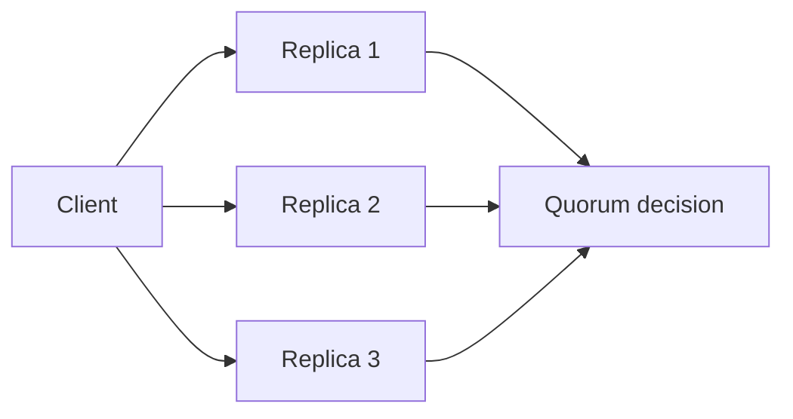

# Replication, quorums, and consistency

Replication stores the same logical data on more than one node.

Copies can improve availability, read capacity, locality, and recovery. They also create a consistency problem because copies can temporarily disagree.

## Replication does not define one consistency model

A replicated system needs rules for how writes become visible and what a read is allowed to return.

Possible guarantees include:

- a read always observes the latest completed write under a defined ordering;
- a read may observe an older replica until replication catches up;
- a client sees its own previous writes even when other clients may not;
- concurrent writes are preserved and reconciled later.

Terms such as strong consistency and eventual consistency are useful only when the observed behavior and scope are clear.

Eventual consistency means replicas are expected to converge when updates stop and communication succeeds. It does not mean every stale value is acceptable or that convergence happens within a fixed time.

## Quorums combine responses

A quorum policy waits for some number of replicas before accepting a read or write.

For `N` replicas, a simplified quorum design may choose a write count `W` and read count `R`.

When `R + W > N`, every read quorum overlaps every write quorum. That overlap can help the reader encounter a replica that participated in the latest accepted write.

Overlap alone does not prove linearizable behavior. Version ordering, concurrent writes, failed writes, repair, and implementation details still matter.

## Consistency versus availability

During a partition, nodes may not be able to both accept every operation and preserve a guarantee that requires coordination across the partition.

The system must define which operations can continue safely.

This is a per-operation and per-invariant decision. A system can use different consistency choices for different data or workflows.

## Repair and conflict handling

Replication mechanisms need a plan for divergence.

Common approaches include:

- one authoritative leader for ordered writes;
- version or timestamp comparison;
- read repair;
- background anti-entropy;
- application-defined conflict resolution;
- conflict-preserving data types where the domain supports them.

Conflict resolution is part of correctness. A deterministic rule that silently drops valid concurrent state can be consistently wrong.

## Practical guidance

State the read and write guarantee in observable terms.

Do not use "replicated" as a synonym for "strongly consistent," and do not use "eventually consistent" as a blanket justification for arbitrary stale reads.

Choose replication and quorum behavior from the invariant, required availability, latency budget, and recovery model.
