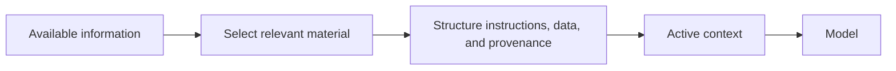

# Context engineering for LLM systems

An LLM can only reason from the information available in its active context and learned parameters. More context is not automatically better context.

Context engineering is the application logic that decides what information reaches the model and how that information is organized.

## Design goals

Provide the information needed for the current task, make instructions and data distinguishable, and remove irrelevant material that competes for attention.

Useful context can include task instructions, authoritative reference material, tool results, prior decisions, examples, and explicit output constraints.

:::caution[Retrieved text is data, not authority]
Untrusted documents, web pages, or tool output can contain instruction-like text. Separate control instructions from retrieved data and do not let untrusted content silently redefine the task.
:::

## Failure modes

Large context can contain stale, conflicting, duplicated, or low-value information. Important instructions can become difficult to locate, and token cost and latency increase.

A model can also treat untrusted retrieved text as instructions unless the application separates data from control clearly.

## Practical guidance

Select context for the current decision. Prefer authoritative and recent material. Preserve provenance for retrieved facts. Summarize history only when the summary keeps the constraints needed for later work.

Treat context construction as application logic that requires tests and evaluation, not as a prompt-writing afterthought.
