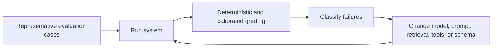

# Evaluate LLM behavior and hallucination risk

LLM output can be fluent and plausible while being unsupported or incorrect. Fluency is not a reliability signal.

The evaluation loop should track application behavior, not only a model version in isolation.

## Evaluation

Build an evaluation set from representative tasks, difficult cases, known failures, and important invariants. Measure the behavior that matters to the application rather than only generic benchmark scores.

Use deterministic checks where possible. Add human or model-based grading only for qualities that cannot be reduced to a reliable rule, and calibrate those graders against examples.

## Hallucination controls

Require external verification for claims that can be checked against authoritative data. Prefer tools or retrieval when the answer depends on current state.

For high-impact actions, separate generation from authorization and execution.

:::caution[Passing evaluations do not prove universal correctness]
An evaluation set samples known behavior. Production can still expose new prompts, data distributions, tool failures, or attack paths that were not represented in the test set.
:::

## Regression testing

Treat model, prompt, retrieval, tool, and schema changes as behavior changes. Re-run evaluations and compare failure categories before deployment.

No evaluation set proves universal correctness. Maintain it as production failures reveal new cases.

## Sources

- National Institute of Standards and Technology. *AI Risk Management Framework*.
