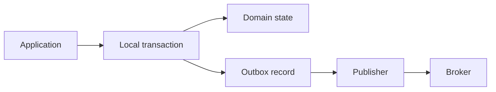

# Transactional outbox and state publication

A common integration problem appears when one operation must change local state and publish a message.

Writing the database first and sending the message second creates a failure window. Sending the message first and writing the database second creates the opposite failure window.

The transactional outbox pattern stores the state change and an outgoing message record in one local transaction.

## Commit the intent once

Inside one database [transaction](../glossary/transaction.md), the application writes:

- the domain state change;
- an outbox record that describes the publication to perform.

If the transaction commits, both records are durable. If it aborts, neither becomes visible.

A separate publisher then reads committed outbox records and delivers them to the messaging system.

## Delivery can repeat

The publisher can crash after sending a message but before marking the outbox record as delivered.

After restart, it may send the same logical publication again.

The outbox therefore pairs naturally with at-least-once delivery and [idempotent](../glossary/idempotency.md) consumers.

The pattern removes the local database-versus-publish gap. It does not create global exactly-once effects.

## Ordering needs an explicit rule

If publication order matters, the outbox must record or derive an order that matches the domain requirement.

Global order can become a bottleneck. Per-aggregate or per-partition order is often enough.

Concurrent transactions can also commit in an order that differs from wall-clock creation time, so a timestamp alone may not define the required sequence.

## Outbox growth is operational state

Delivered records need a retention or cleanup policy.

The publisher needs metrics for lag, failures, oldest undelivered record, throughput, and repeated delivery.

A stalled outbox can mean the database is correct while downstream systems become increasingly stale.

## When not to use it

If the database and message system participate safely in one established distributed transaction and the operational cost is justified, an outbox may be unnecessary.

If no message must be published reliably, adding an outbox only adds persistence and operational work.

## Practical guidance

Use a transactional outbox when local state and publication intent must not diverge and one local transaction can own both records.

Make publisher delivery retryable, consumers idempotent, and lag observable. Treat outbox cleanup and replay as part of the pattern, not as later maintenance details.
