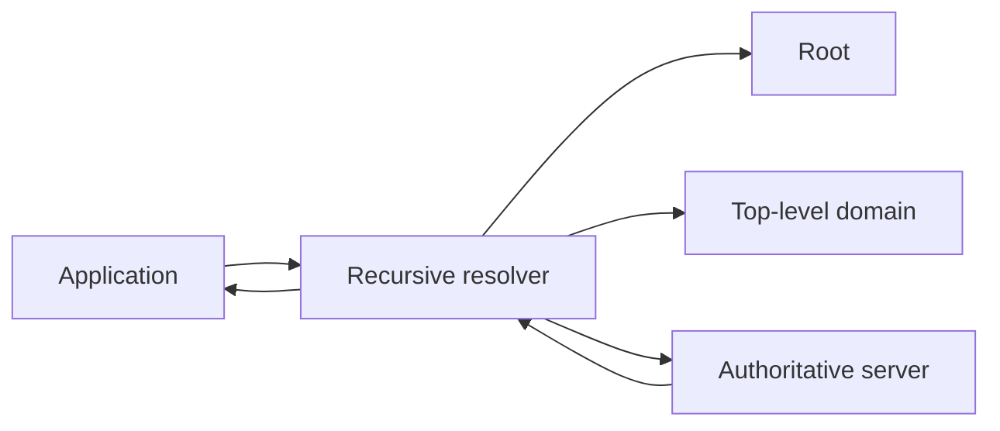

# DNS resolution

The Domain Name System maps hierarchical names to records such as IP addresses, mail servers, and service metadata.

DNS is distributed and heavily cached. A name lookup is therefore a protocol interaction with freshness and failure behavior, not a local string-to-address function.

## Resolution path

An application usually asks a local resolver for a name. That resolver may answer from cache or query other DNS servers until it can return an answer, a negative result, or an error.

A simplified path is:

The resolver can skip upstream work when it has a usable cached result.

## TTL controls cache freshness

DNS records carry a [time to live](../glossary/time-to-live.md) value that tells caches how long they may reuse the record before refreshing it.

TTL does not guarantee that every client observes a change at the same moment. Different caches may have learned the old record at different times.

Negative results can also be cached. An earlier lookup failure can therefore remain visible briefly after a record is created or corrected.

## DNS failure is a network failure mode

A DNS lookup can fail because of timeout, unreachable resolvers, configuration errors, missing records, DNSSEC validation failures, or upstream server problems.

An application should distinguish name-resolution failure from connection failure after resolution.

Retries can help some transient failures, but aggressive retry loops can amplify an outage at shared resolvers.

## Multiple answers are normal

A name can resolve to several addresses. Clients and resolvers can select or order those addresses according to protocol and implementation rules.

Do not assume one hostname identifies one machine permanently.

This matters for load distribution, failover, dual-stack networking, and rolling infrastructure changes.

## Practical guidance

Treat DNS as a cached distributed dependency.

Choose TTL from the desired change speed and query load rather than setting it mechanically. Observe lookup latency and failure separately from later connection and HTTP latency.

When diagnosing a network problem, verify the resolved record as well as the application endpoint. A correct HTTP service cannot be reached through an incorrect or stale name resolution path.
