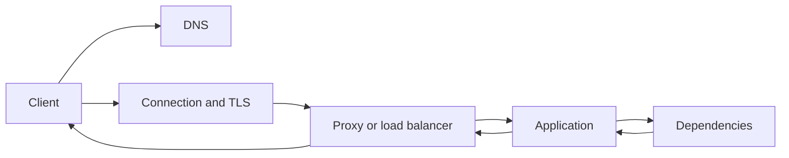

# HTTP request and response lifecycle

An HTTP operation spans more than application handler execution.

A client may need name resolution, connection establishment, TLS, proxy traversal, server queueing, application processing, response transfer, and connection cleanup or reuse.

Understanding these stages makes latency and failure diagnosis more precise.

## A simplified path

Not every request performs every stage. DNS and connections can be reused, and some responses can come from caches before the origin application runs.

## HTTP semantics are separate from transport

HTTP defines methods, status codes, header fields, representation metadata, caching semantics, and message meaning.

The transport below HTTP can differ. HTTP/1.1 and HTTP/2 commonly use TCP with TLS for HTTPS. HTTP/3 uses QUIC over UDP.

Application code should reason from HTTP semantics instead of assuming one transport implementation detail is universal.

## Timeouts belong to stages

A single "request timeout" can hide several independent waits:

- DNS resolution;
- connection establishment;
- TLS handshake;
- waiting for a response header;
- reading the response body;
- waiting for an upstream dependency inside the server.

When the platform exposes separate controls, choose bounds that match the stage and the caller's total latency budget.

## Status codes do not report every failure

An HTTP status code exists only after an HTTP peer returns a response.

DNS failure, connection refusal, certificate validation failure, transport reset, and timeout can occur before any HTTP response exists.

Do not normalize every network failure into a fake HTTP status. Preserve the failure category for observability and retry decisions.

## Intermediaries can change the path

Proxies, gateways, caches, and load balancers can receive, forward, reject, or satisfy requests.

Headers and status codes may therefore describe behavior at an intermediary rather than the origin application.

Production debugging should identify which hop produced the observed result.

## Practical guidance

Measure end-to-end latency and, where useful, break it into resolution, connect, TLS, server, and transfer phases.

Keep the [API contract](../glossary/api-contract.md) at the HTTP application boundary, but diagnose failures across the complete request path.
