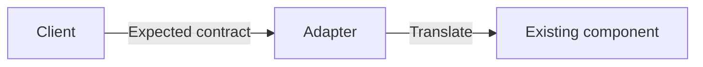

# Adapter pattern

An Adapter translates between a client-facing contract and an incompatible existing interface.

## Problem

A useful component cannot be used directly because its API, data model, protocol, or calling convention does not match the client boundary.

Changing the component may be impossible, undesirable, or more expensive than translating at the edge.

## Context

Use an Adapter when the mismatch is structural and the underlying behavior remains appropriate.

Common examples include vendor SDKs, legacy APIs, external data models, and platform-specific implementations.

:::tip[Keep translation at the edge]
A small Adapter can keep vendor types and calling conventions from spreading into policy code.
:::

## Trade-offs

An Adapter isolates incompatibility, but it adds another layer and another contract to maintain.

Translation can also lose information when the two models are not equivalent.

## Failure modes

A thin Adapter can become a useful anti-corruption boundary. A large Adapter can become a second business-logic layer if it starts owning policy rather than translation.

A leaky Adapter exposes vendor-specific types or semantics through the supposedly stable interface. Clients then remain coupled to the original dependency.

## When not to use it

Do not add an Adapter when the existing interface already fits the client and no meaningful boundary is gained.

Do not use translation to hide a semantic mismatch. If the underlying component does not satisfy the required contract, an Adapter cannot make it correct by renaming methods.

## Sources

- Erich Gamma, Richard Helm, Ralph Johnson, and John Vlissides. *Design Patterns: Elements of Reusable Object-Oriented Software*. Addison-Wesley, 1994.
