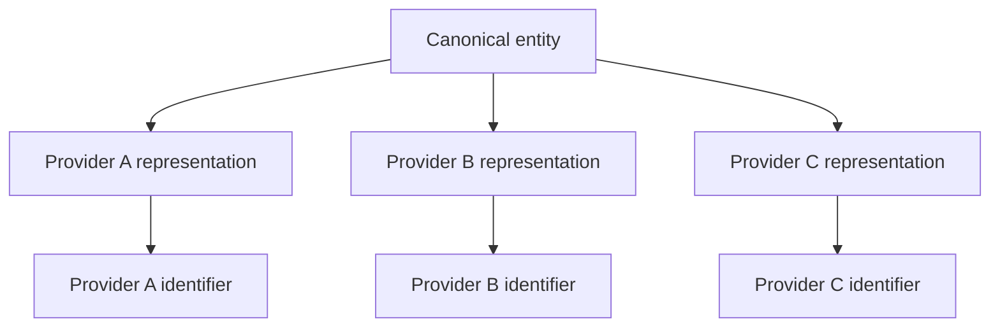

# Separate canonical domain entities from provider representations

An external provider record describes a provider's view of a domain concept. It is not automatically the domain concept itself.

Use a canonical entity when one real concept can have several provider representations, identifiers, names, attributes, or publication rules.

## Model

Keep stable domain identity separate from provider-owned representations.



The canonical entity owns the identity used by the application. Each provider representation owns the identifier and fields that belong to that provider.

This structure lets the system add, replace, reconcile, or remove a provider without replacing the domain identity.

## Keep provider identifiers provider-scoped

A provider identifier is usually unique only inside that provider's namespace.

Store it with the provider identity. Do not promote it to the canonical identifier unless the domain is intentionally defined by that provider.

A provider-scoped key can use a structure such as:

```text
(provider, provider_record_id)
```

The canonical entity should use its own stable identifier when the application must survive provider changes.

## Reconcile without erasing disagreement

Two providers can disagree about names, dates, classifications, relationships, or other metadata.

Do not force the provider records to become identical before they can map to one canonical entity. Preserve the provider values and resolve the canonical value through an explicit rule.

The rule can use source priority, confidence, recency, manual review, or another domain-specific policy.

The important constraint is that the canonical value and the source values remain distinguishable.

## Treat identity resolution as a separate concern

Mapping a provider record to a canonical entity can be exact, heuristic, or manual.

Do not hide uncertain identity resolution inside a normal field update. A wrong identity merge can corrupt every downstream field even when each individual provider value is correct.

Useful identity evidence can include:

- stable provider mappings;
- normalized names or aliases;
- release or creation dates;
- ownership or creator relationships;
- manually reviewed matches.

The evidence depends on the domain. The model should allow uncertainty instead of requiring every imported record to match immediately.

## Failure modes

### Provider identity becomes domain identity

The application can become coupled to one provider's identifiers, lifecycle, and data model. Replacing that provider can then require changing internal identity across the system.

### Provider fields overwrite each other

If several providers write directly into one canonical record, the system can lose which source supplied a value and why the current value won.

### Duplicate canonical entities

Weak matching can create several canonical entities for one real concept. Deduplication then becomes an identity problem rather than a simple field update.

### Incorrect merge

An aggressive matcher can attach unrelated provider records to one canonical entity. This is often more damaging than leaving the records temporarily unmatched.

## When a canonical entity is unnecessary

Do not add this layer when the application intentionally models one provider and that provider defines the identity of the domain object.

A direct provider model can be simpler when:

- only one provider exists;
- provider replacement is not a requirement;
- no cross-provider reconciliation is needed;
- the provider identifier is intentionally the product identity.

The extra canonical layer is justified when the domain must outlive or combine provider representations.

## Practical rule

Treat external records as evidence about a domain entity, not as automatic ownership of domain identity.

Keep canonical identity stable. Keep provider identifiers and provider-specific values attached to the provider representation that owns them.
