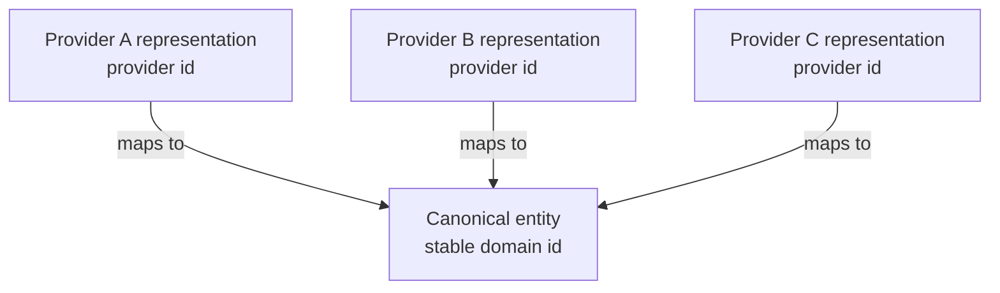

# Separate canonical domain entities from provider representations

An application often integrates with several external providers that each describe the same real-world concept: the same game on several storefronts, the same customer in several payment processors, the same article in several syndication feeds.

Each provider exposes its own record, its own identifier, and its own view of the attributes. None of those records is the domain concept itself.

## Problem

When an application stores only a provider's record and treats it as the entity, the domain model inherits that provider's identifier, lifecycle, and data shape. Adding a second provider then has no natural place to live, and replacing the first provider means migrating the identity that the rest of the system depends on.

Cross-provider disagreement compounds the problem. Two providers can report different names, dates, or classifications for what is otherwise the same concept, and a model built around one provider record has no field for the discrepancy.

:::caution[A provider record is not the domain identity]
A provider record describes that provider's view of a concept. Treat it as evidence about the domain entity, not as the entity's identity.
:::

## Model

Introduce a canonical entity with its own stable identifier, and keep each provider's record as a separate provider representation linked to that identifier.

The canonical entity owns the identifier the rest of the application uses and the attributes the application resolves as authoritative. Each provider representation owns the fields and identifier that belong to that provider, plus the mapping that links it to a canonical entity.

This separation lets the system add, replace, or drop a provider without changing the domain identifier that other code already depends on.

## Keep provider identifiers scoped to the provider

A provider identifier is usually unique only inside that provider's own namespace. Two providers can reuse the same identifier value for unrelated concepts.

Store a provider identifier together with the provider it came from, for example as a `(provider, provider_record_id)` pair, rather than promoting it directly to the canonical identifier. Give the canonical entity its own identifier when the application must survive a provider change.

## Reconcile disagreement without erasing it

Providers can disagree about names, dates, classifications, or other attributes for the concept they both describe.

Do not force provider records to agree before they can map to one canonical entity. Keep each provider's reported value alongside the canonical value, and resolve the canonical value through an explicit rule such as source priority, recency, or manual review.

The canonical value and the provider values that produced it must stay distinguishable, so a later review can see why the canonical value won.

## Treat identity resolution as a separate concern

Deciding that a provider record belongs to a given canonical entity is a distinct step from updating that entity's fields. The match can be exact, such as a stable external key, or it can be heuristic or manual.

Do not fold an uncertain match into a normal field update. An incorrect match can attach an unrelated provider record to the wrong canonical entity, and every field that entity later reports becomes suspect, even when each individual provider value was accurate.

Two related failure modes follow from weak matching:

- Duplicate canonical entities appear when matching is too strict and the same real concept gets a second canonical identity. Deduplication then has to merge canonical entities, not just update fields.
- Incorrect merges appear when matching is too loose and an unrelated provider record attaches to an existing canonical entity. This is usually more damaging than leaving a record temporarily unmatched, because it mixes unrelated data under one identity.

## When a provider record can safely remain the primary model

The canonical layer is not always worth its cost. Skip it when the application intentionally models a single provider and that provider's identifier is the product's identity.

A direct provider model is usually simpler when:

- only one provider exists and no second provider is planned;
- the application does not need to survive that provider being replaced;
- no cross-provider reconciliation is required;
- the provider's identifier is deliberately treated as the domain identifier.

Add the canonical entity only when the domain needs to outlive a single provider or combine data from more than one.

## Trade-offs

A canonical entity adds a second identifier, a mapping between it and each provider representation, and a reconciliation rule to design and maintain. That cost is only justified when the application actually needs providers to be replaceable or combinable.

Skipping the canonical layer keeps the model simpler, but any later decision to add a second provider becomes a migration instead of an addition.
