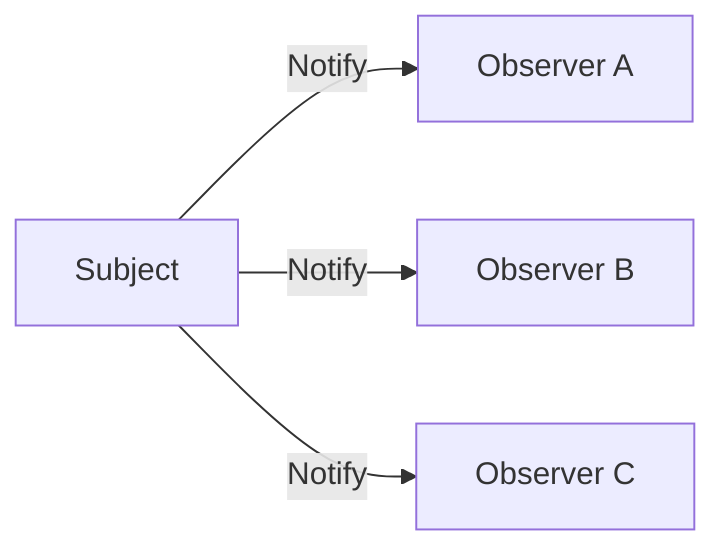

# Observer pattern

Observer lets a subject publish a change to dependent consumers without embedding each consumer's behavior in the subject.

## Problem

Several consumers need to react to a state change, and the producer should not know each concrete consumer.

## Context

Observer fits in-process event notification, UI state propagation, domain notifications, and similar one-to-many relationships.

The pattern is most useful when adding or removing consumers should not change the producer.

## Trade-offs

Observer reduces direct coupling between producer and consumers. It also makes control flow less explicit because a change can trigger work elsewhere.

Ordering, failure handling, reentrancy, and subscription lifetime become part of the design.

:::caution[Hidden work is still work]
A notification can trigger expensive or state-changing behavior outside the caller's visible control flow. Keep observer effects bounded and observable.
:::

## Failure modes

Hidden chains of observers can make one state change cause surprising secondary effects.

Missing unsubscription can retain objects longer than intended. Synchronous observers can also turn a small operation into an unexpectedly expensive one.

## When not to use it

Do not use Observer when one explicit call is clearer and the producer already owns the dependent action.

Do not confuse an in-process Observer with a durable distributed event system. Delivery guarantees, persistence, retries, ordering, and idempotency require additional mechanisms.

## Sources

- Erich Gamma, Richard Helm, Ralph Johnson, and John Vlissides. *Design Patterns: Elements of Reusable Object-Oriented Software*. Addison-Wesley, 1994.
