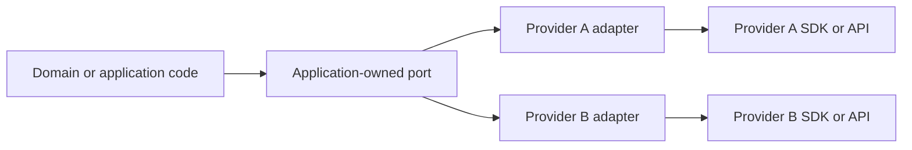

# Design provider-neutral integration boundaries

An external SDK exposes the provider's model. The application often needs a smaller capability with its own semantics.

Use a provider-neutral boundary when the application should depend on the capability rather than on one provider's API shape.

## Structure



The port belongs to the application. The adapters translate provider behavior into that contract.

This is an application of Adapter, Ports and Adapters, and dependency inversion. The specific value here is the provider-replacement and policy boundary.

## Design contracts around capabilities

Name the boundary after what the application needs to do, not after the current vendor.

Examples can include:

```text
TransactionalEmailProvider
BillingProvider
GameMetadataProvider
AnalyticsSink
ObjectStorage
```

A capability-oriented contract makes the dependency clearer than exposing the provider SDK throughout application code.

The contract should contain only semantics the application can define and test.

## Do not build a lowest-common-denominator API

Provider neutrality does not require hiding every provider difference.

A weak abstraction can remove useful capabilities until every provider looks identical. This can make the system harder to use without making provider replacement realistic.

Prefer one of these approaches when providers differ materially:

- keep the shared contract small and stable;
- model optional capabilities explicitly;
- split unrelated capabilities into separate ports;
- allow provider-specific behavior in infrastructure code when the domain does not depend on it.

Do not add generic options bags that simply recreate each provider SDK behind another name.

## Normalize failures at the boundary

Provider errors often expose HTTP codes, SDK exception types, or vendor-specific retry hints.

Translate them when the application needs stable failure semantics such as:

- temporary failure;
- permanent rejection;
- invalid request;
- unavailable capability;
- rate or quota limitation.

Keep original provider diagnostics available for logs or debugging when they are safe to retain.

Do not discard useful detail only to make all failures look identical.

## Keep policy above the adapter when possible

Business and product policy should usually not be hidden inside one provider adapter.

For example, the application can decide whether a notification may be sent. The adapter should decide how to send it through the provider.

This separation prevents provider replacement from changing product policy accidentally.

## Test the contract, not only the adapter

A provider-neutral boundary is useful only if application behavior can rely on it.

Test:

- contract-level behavior expected by callers;
- adapter translation of provider responses;
- failure normalization;
- provider-specific capability differences that affect callers.

A fake or in-memory implementation can help test application logic, but it must not replace integration tests that verify real adapter behavior.

## Failure modes

### Provider SDK leaks into domain code

Types, exceptions, identifiers, and configuration from one provider spread through the application. Replacement becomes a cross-cutting rewrite.

### The abstraction mirrors one provider exactly

The interface has a neutral name but still exposes one provider's concepts. A second adapter becomes awkward or misleading.

### Every provider feature is hidden

The abstraction becomes too weak. Valuable provider capabilities cannot be used even when the application needs them.

### Policy moves into infrastructure

Different adapters make different product decisions because the boundary does not separate policy from transport or provider mechanics.

## When direct SDK use is better

Do not add a provider-neutral boundary automatically.

Direct SDK use can be clearer when:

- the integration is small and isolated;
- replacement is unlikely and has no meaningful architectural cost;
- the provider defines the product capability itself;
- an abstraction would only rename the provider API.

Add the boundary when it reduces coupling, centralizes policy, improves testing, or makes provider diversity a real supported requirement.

## Practical rule

Own the contract at the application boundary when the application owns the capability semantics.

Do not abstract a provider merely to claim provider independence.
