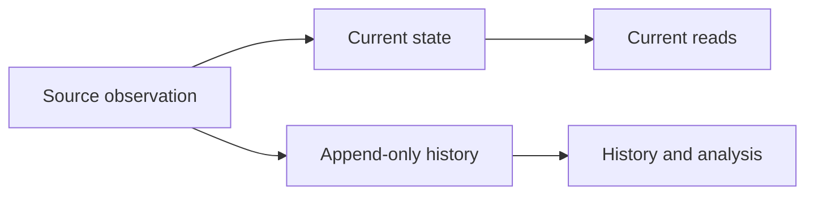

# Separate current state from observation history

A current-state record answers what is true now. An observation history records what the system observed over time.

These are different read needs. One structure does not always serve both well.

## Model

Keep a compact current representation for normal reads and append observations when historical change matters.

The current state can be updated in place. The history keeps prior observations rather than replacing them.

## Keep current reads simple

A current-state table or document should contain the values needed by the common read path.

The reader should not need to scan the full history and find the newest observation for every request unless that cost is acceptable and intentional.

Materializing current state can reduce read work and make indexes, constraints, and cache keys easier to design.

## Make observations append-oriented

An observation should normally record enough context to explain what was seen.

Useful fields can include:

- subject identity;
- observed value;
- observation time;
- source or provider;
- source record identity;
- ingestion time when it differs from observation time.

Do not mutate old observations only to make them match the current state. Correct bad history through an explicit correction rule when the domain requires it.

## Avoid writing meaningless history

Append-only does not mean append every poll or read.

If a source reports the same value repeatedly, the system can choose between recording every observation and recording only meaningful changes.

The choice depends on the question the history must answer.

Record every observation when observation frequency itself matters. Record changes when the main requirement is change history and duplicate observations add little value.

## Keep current state and history consistent enough for their purpose

The current record and history can be updated in one transaction when the storage system and write path support it.

When atomic update is not available, define which failure is acceptable and how reconciliation works.

For example, a system can prioritize current-state correctness and repair missing history later, or it can reject the write unless both representations succeed.

The required consistency depends on whether history is analytical, contractual, financial, or operational.

## Retention is a separate decision

Current state usually has natural bounded size. History can grow without bound.

Define retention, aggregation, partitioning, or archival rules before history growth becomes an operational problem.

Do not delete historical detail merely because current reads no longer need it if another requirement still depends on the detail.

## Failure modes

### History is used as the only current-state index

Every read must find the latest event or observation. This can make simple reads increasingly expensive as history grows.

### Current updates overwrite all evidence

The system serves current values efficiently but cannot explain when a value changed, where it came from, or what was previously observed.

### Duplicate observations grow without purpose

A high-frequency poller appends unchanged values forever even though no requirement uses observation frequency.

### History and current state drift silently

Separate writes can partially fail. Without reconciliation, the current record and the newest history entry can disagree indefinitely.

## When one representation is enough

Do not split the model when historical queries are rare, data volume is small, or the existing event log can answer current reads efficiently.

An event-sourced model can intentionally derive current state from the event stream. A simple application can also keep only current state when history has no product or operational value.

Use the split when current reads and historical analysis have materially different access patterns or retention needs.

## Practical rule

Optimize the current representation for what the system needs now. Preserve history in a form that can explain change without making every current read reconstruct the past.
