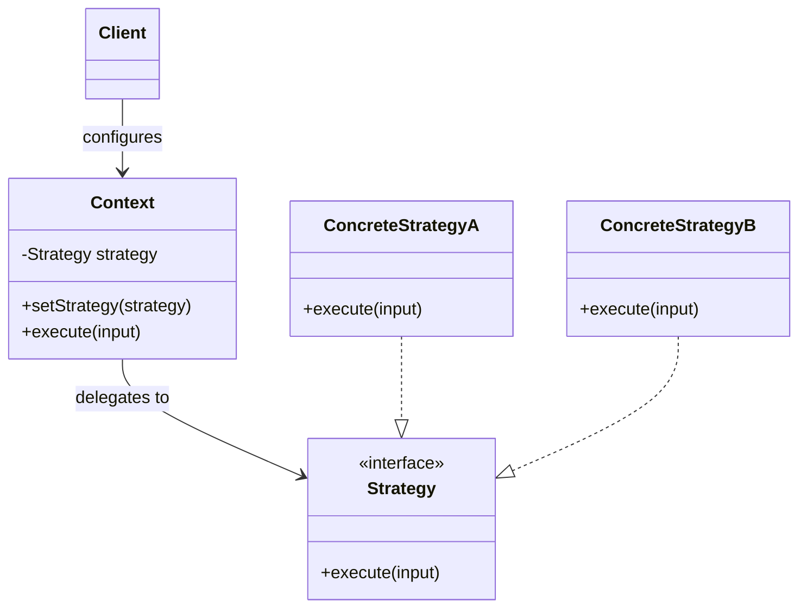

# Strategy pattern

Strategy separates a variable algorithm or policy from the object that uses it. Each strategy provides the same contract, and the context delegates the work to the selected strategy.

The pattern is useful when several implementations perform the same responsibility but differ in how they perform it.

:::note[At a glance]
**Problem:** One component owns several interchangeable implementations of the same responsibility.

**Use when:** A caller must select or replace an algorithm independently from the context that uses it.

**Avoid when:** The variants are few, stable, local, or not meaningfully interchangeable.

**Core idea:** Put the varying behavior behind one stable contract and let the context delegate to it.
:::

## Problem

A component can accumulate several versions of the same operation. A growing conditional may select an implementation based on configuration, user choice, environment, or runtime data.

This design gives the component several reasons to change. Adding or modifying one algorithm can require editing code that also coordinates the rest of the component.

Inheritance can move each variant into a subclass, but it also binds the behavior choice to the object's type. That is a poor fit when the behavior must vary independently.

## Structure

Strategy has four main roles:

- **Context** owns the workflow that needs variable behavior.
- **Strategy contract** defines the operation that all variants must provide.
- **Concrete strategies** implement different versions of that operation.
- **Client or selection logic** chooses the strategy that the context will use.

The context depends on the strategy contract instead of concrete implementations.



At runtime, the client calls the context. The context delegates the variable part of the operation to whichever strategy was selected.

## Example

A compression service can support several algorithms without putting every implementation into the service itself.

```ts title="compression-strategy.ts"
interface CompressionStrategy
{
    compress(data: Uint8Array): Uint8Array;
}

class Compressor
{
    constructor(private strategy: CompressionStrategy)
    {
    }

    setStrategy(strategy: CompressionStrategy): void
    {
        this.strategy = strategy;
    }

    compress(data: Uint8Array): Uint8Array
    {
        return this.strategy.compress(data);
    }
}
```

A gzip strategy and a Zstandard strategy can implement the same contract. The caller selects the strategy, while the compressor only coordinates the operation.

The important part is not the class structure. The important part is that the varying behavior has a stable boundary and can be replaced without rewriting the context.

## When to use it

Use Strategy when:

- several implementations have the same responsibility;
- the implementation must be selected or replaced independently from the context;
- variants change for different reasons;
- a large conditional mainly selects between algorithm variants;
- inheritance would create subclasses only to vary one behavior.

## Trade-offs

| Benefits | Costs |
| --- | --- |
| Isolates algorithms so they can evolve independently. | Adds indirection between the context and the selected behavior. |
| Makes variable behavior an explicit dependency. | Object-oriented implementations can add interfaces, classes, construction logic, and wiring. |
| Favors composition over inheritance. | Selection responsibility still exists somewhere in the system. |
| Supports independent testing and replacement of implementations. | A weak common contract can hide meaningful differences between implementations. |

:::caution[Strategy moves selection responsibility]
The caller or another component must still know enough to choose a strategy. Strategy separates selection from execution; it does not remove the selection problem.
:::

A weak strategy contract can become a lowest-common-denominator abstraction. If implementations need unrelated inputs or expose different semantics, they may not represent one interchangeable responsibility.

## When not to use it

Do not introduce Strategy only because two small code paths look different. A direct conditional can be clearer when the variants are few, stable, and local.

Do not force unrelated behaviors behind one strategy contract. Interchangeability should be meaningful to the caller.

If behavior changes through explicit state transitions and each behavior represents a state of the same object, the State pattern can be a better model.

If subclasses customize steps in a fixed algorithm skeleton, Template Method can be a better fit. It uses inheritance rather than composition and solves a different problem.

## Modern implementations

Strategy does not require one class per algorithm.

Languages with first-class functions can represent a strategy as a function, closure, callable object, or function value. This can preserve the pattern's intent with less structural overhead.

```ts title="function-strategy.ts"
type CompressionStrategy = (data: Uint8Array) => Uint8Array;

function compress(data: Uint8Array, strategy: CompressionStrategy): Uint8Array
{
    return strategy(data);
}
```

:::tip[Use the smallest useful representation]
Use classes when strategies need identity, dependencies, lifecycle, state, or a richer contract. Use functions when the behavior is small and naturally expressed as a callable value.
:::

The representation can change while the pattern intent stays the same: interchangeable behavior remains behind a stable contract.

## Failure modes

### Strategy explosion

Creating a class for every minor variation can make a simple design difficult to navigate. Prefer a smaller representation when the variation does not need its own abstraction.

### Leaky context

A strategy that depends on many internal details of its context is not meaningfully isolated. The dependency boundary becomes nominal rather than real.

### Scattered selection logic

If many callers repeat the same strategy-selection rules, the system gains another source of duplication and inconsistency. Centralize selection when it represents shared policy.

### False interchangeability

Two implementations are not interchangeable only because they share a method signature. They must preserve the contract that callers depend on.

## Related knowledge

- [Prefer composition over inheritance](../principles/composition-over-inheritance.md) — explains why variable behavior is usually easier to evolve through composition than subtype hierarchies.

## Sources

:::note[Provenance]
The core Strategy definition and structure are literature-backed. The guidance to use the smallest useful representation is DKKB-derived guidance.
:::

- Erich Gamma, Richard Helm, Ralph Johnson, and John Vlissides. *Design Patterns: Elements of Reusable Object-Oriented Software*. Addison-Wesley, 1994.
- [Strategy, Refactoring.Guru](https://refactoring.guru/design-patterns/strategy)
