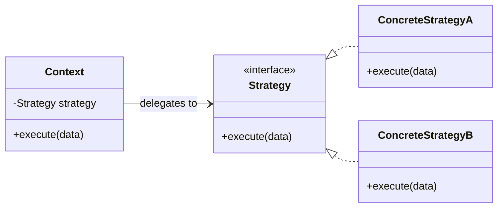

# Strategy pattern

The Strategy pattern defines a family of interchangeable algorithms or behaviors behind one contract. A context delegates the varying behavior instead of implementing every variant itself.



The context depends on the Strategy contract. Concrete strategies can change without changing the context.

## Context

Use Strategy when one responsibility has several valid implementations and the caller should not contain a growing conditional that selects each implementation.

The pattern is especially useful when algorithms need independent testing, when behavior changes at runtime, or when a stable context must accept new variants without modification.

## Example

```ts
interface CompressionStrategy
{
    compress(data: Uint8Array): Uint8Array;
}

class Compressor
{
    constructor(private readonly strategy: CompressionStrategy)
    {
    }

    compress(data: Uint8Array): Uint8Array
    {
        return this.strategy.compress(data);
    }
}
```

A caller can construct `Compressor` with a ZIP, Brotli, or another strategy without changing `Compressor`.

## Trade-offs

Strategy introduces an abstraction and usually more objects or functions. This is useful only when the variation is meaningful enough to justify the extra boundary.

Callers may also need to understand which strategy is appropriate. Moving an `if` statement from the context into a factory does not remove the decision. It only moves it.

For small, fixed behavior, a function parameter or a direct conditional can be clearer than a full class hierarchy.

## Failure modes

Strategy becomes ceremony when every implementation is trivial, when only one implementation exists, or when strategies depend on large parts of the context's internal state.

It also fails when implementations do not actually share one coherent contract. Forcing unrelated behavior behind one interface can hide important differences instead of simplifying them.

## Related knowledge

- [Prefer composition over inheritance](../principles/composition-over-inheritance/)

## Sources

- Erich Gamma et al. *Design Patterns: Elements of Reusable Object-Oriented Software*.
- Refactoring.Guru. *Strategy*.
