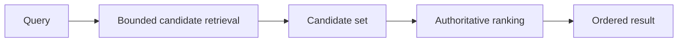

# Bound candidate retrieval before expensive ranking

A rich ranking algorithm can be too expensive to run against every stored record for every request.

Use a two-stage read when storage can cheaply produce a bounded candidate set and application code can rank those candidates with the authoritative algorithm.

## Two-stage model

Candidate retrieval answers which records are worth evaluating. Ranking answers which candidates are best.

Do not let an optimization in the first stage silently redefine the ranking semantics of the second stage.

## Keep the candidate stage cheap and bounded

The first stage should use operations that storage can execute predictably with suitable indexes or bounded scans.

Useful candidate signals can include:

- exact or normalized keys;
- prefixes;
- tokens or n-grams;
- categories or filters;
- precomputed search terms;
- coarse numeric or date bounds.

Apply an explicit candidate limit. A candidate query that can still return the full corpus has not created a useful performance boundary.

## Keep ranking authority explicit

When application ranking defines product behavior, treat it as authoritative.

The storage query can order candidates to improve recall or efficiency, but that order should not become the final order by accident.

This matters when the ranking algorithm uses behavior that is difficult, fragile, or expensive to reproduce in SQL or another storage query language.

## Size the candidate bound from evidence

A smaller candidate set reduces CPU, memory, transfer, and ranking work. It also increases the risk that the true best result is excluded before ranking.

Measure both sides:

- candidate count and ranking cost;
- recall of expected top results;
- latency at realistic corpus sizes;
- worst-case queries;
- behavior when filters are selective or broad.

Do not choose a limit only because it performs well on a small development data set.

## Make misses observable

A bounded candidate stage can fail by omission. The system can return a fast but incorrect result set because the right record never reached the ranking stage.

Use representative query tests and, where practical, compare bounded results with an unbounded or offline reference implementation.

A regression test can assert that known top results remain inside the candidate set before it checks final ranking.

## Preserve deterministic behavior

Candidate generation and final ranking need deterministic tie-breaking when they feed pagination, caches, or reproducible tests.

If two candidates have equal ranking scores, use stable secondary keys. Do not depend on unspecified storage order.

The candidate query should also avoid nondeterministic truncation when its limit can exclude records with equal coarse scores.

## Consider fallback paths

Some queries can produce weak candidate signals.

A bounded system can use a broader second attempt when the first stage returns too few useful candidates or when a query shape is known to reduce recall.

Keep fallback bounded as well. A fallback that performs an uncontrolled full scan can restore correctness at the cost of unpredictable latency.

## Failure modes

### Candidate limit becomes ranking logic

The storage engine returns the first N rows under a coarse order and the application treats them as the only semantically valid results without measuring recall.

### Application ranks the full corpus

The ranking algorithm remains correct but request cost grows with total data size.

### SQL reimplements a complex ranking algorithm poorly

The system gains one query but creates two ranking implementations with different semantics and maintenance cost.

### Pagination happens before authoritative ranking

The storage layer pages a coarse candidate order before the application ranks it. Relevant results can be stranded on later pages.

## When storage-native ranking is better

Do not split ranking when the storage engine already provides the required semantics, performance, and deterministic behavior.

Full-text search engines, vector indexes, or database-native ranking can be the authoritative layer when their scoring model is the intended product behavior.

Use the two-stage design when candidate generation and final ranking have different strengths and the final algorithm must remain outside storage.

## Practical rule

Bound the expensive work without changing who owns ranking semantics.

Measure candidate recall as carefully as ranking latency.
