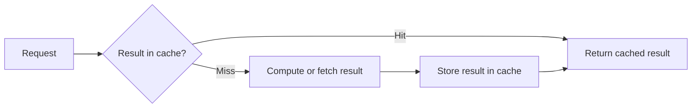

# Caching

A cache stores the result of expensive work so a later request with the same input can reuse the result instead of repeating the work.

## Problem

Recomputing or refetching the same result repeatedly wastes CPU, database capacity, or network calls when the underlying data changes far less often than it is read.

A cache trades that repeated cost for the cost of storing, invalidating, and reasoning about a second copy of the data.

## Context

Caching helps most when reads greatly outnumber writes, when the source computation or fetch is expensive relative to a cache lookup, and when some staleness is acceptable for the affected data.

Placement varies by system: a cache can sit in the client, a content delivery network, an application process, or a dedicated cache store in front of a database.

:::caution[A cache changes a correctness property, not only a speed property]
A cached value can be stale the moment it is read. Decide how stale a value may be before it must be refreshed or invalidated, and document that bound for callers.
:::

## Invalidation strategies

Common approaches include:

- time-based expiry, where a cached value is discarded after a fixed duration;
- write-through invalidation, where a write updates or removes the cached value at the same time as the source;
- cache-aside, where the application checks the cache first and populates it on a miss;
- event-based invalidation, where a change notification triggers removal of the affected entries.

Each approach places the correctness burden in a different place.
Time-based expiry is simple but permits stale reads within the expiry window.
Write-through invalidation is more precise but requires every write path to update the cache correctly.

## Failure modes

A cache stampede occurs when a popular cached value expires and many concurrent requests recompute it at once, which can overload the source it was meant to protect. This is a form of thundering herd.

Inconsistent invalidation can leave stale data behind one code path while another path updates the cache correctly, producing intermittent incorrect reads that are difficult to reproduce.

A cache that becomes unavailable can silently remove protection from the backing system. If every request falls through to the source at once, the outage can be worse than never having a cache.

An unbounded cache can grow until it exhausts available memory. Bound cache size explicitly and choose an eviction policy, such as least-recently-used, that fits the access pattern.

## Trade-offs

Caching adds an additional component that can fail independently of the source data, and it introduces the possibility of returning an answer that is technically wrong at the instant it is read.

It also adds operational cost: cache capacity, eviction tuning, and monitoring for hit rate and staleness all require ongoing attention.

## When not to use it

Do not cache data that changes on every read or where strict, immediate consistency is required and staleness cannot be tolerated at any bound.

Do not add a cache to a path that is not measured as expensive. A cache in front of an already-fast operation adds complexity and a new failure mode without a proportional benefit.

## Sources

- Amazon Web Services. "Caching challenges and strategies."
