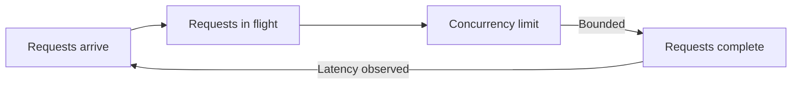

# Latency vs throughput

Latency is how long one operation takes from request to response. Throughput is how much work a system completes per unit of time.

The two measures are related but distinct, and a change that improves one can reduce the other.

## Why the distinction matters

A system can have low latency and low throughput, such as a lightly loaded service that answers each request quickly but serves few clients.

A system can also have high throughput and high latency, such as a batch pipeline that processes a large volume of data with a long per-item delay.

Reporting only one measure hides the other. A dashboard that shows throughput alone can conceal that individual requests have become slower even as total volume holds steady.

## How they relate

Little's Law connects the two measures through concurrency: the average number of requests in a system equals the arrival rate multiplied by the average time each request spends in the system.

Raising concurrency can raise throughput up to the point where a resource saturates. Beyond that point, added concurrency increases queueing and latency without a matching gain in throughput.

## Common optimization traps

Batching multiple operations together can raise throughput by amortizing fixed cost, but it adds latency because early items in a batch wait for the batch to fill.

Adding worker threads or connections can raise throughput until a shared resource, such as a database connection pool or a CPU core, saturates. After that point, added concurrency mostly adds queueing delay.

Optimizing for the average latency can hide a growing tail. A system with an acceptable average and a severe 99th-percentile latency can still fail its slowest users.

:::caution[Report a distribution, not only an average]
Average latency can stay stable while tail latency grows. Track percentiles such as p50, p95, and p99 alongside throughput to see both the typical case and the worst case.
:::

## Trade-offs

Prioritizing throughput usually favors larger batches, higher concurrency, and shared queues, which increases per-item latency and variance.

Prioritizing latency usually favors smaller batches, bounded concurrency, and dedicated capacity, which can reduce the maximum sustainable throughput for the same resources.

The correct balance depends on the workload. An interactive user-facing request generally favors low latency. A background data pipeline generally favors high throughput.

## Failure modes

A queue that grows without bound converts throughput problems into latency problems, because waiting time in the queue dominates total response time.

Confusing the two measures during capacity planning can size a system correctly for peak throughput while leaving individual requests too slow, or the reverse.

Bounded concurrency and bounded queues keep throughput gains from silently degrading latency past an acceptable limit. Caching can reduce latency and raise throughput together when it removes expensive work from the common path.

## Sources

- John D. C. Little. "A Proof for the Queuing Formula: L = λW." *Operations Research*, vol. 9, no. 3, 1961.
- Google. *Site Reliability Engineering*, "Monitoring Distributed Systems."
