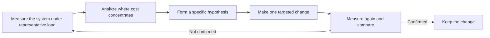

# Measure before optimizing

A performance change should follow a measurement that identifies where time, memory, or another resource is actually spent.

Code that looks slow is not always the code that costs the most. Intuition about hot paths is frequently wrong once a system runs under realistic load and data volume.

## The problem

Changing code for performance without measurement risks two failures at once: the change may not affect the real bottleneck, and it may add complexity that a future reader must still maintain.

Effort spent on a component that contributes little to the total cost cannot produce a large overall improvement, no matter how effective the local optimization is.

## The measure, analyze, optimize loop

A disciplined approach repeats a small loop instead of editing code directly from suspicion.

Each pass should change one variable so the measurement can attribute the result to that change.

:::caution[A profiler needs representative conditions]
A microbenchmark or a profiler run against unrealistic input, size, or concurrency can point at a bottleneck that does not exist in production. Match the measured workload to the workload that matters.
:::

## What to measure

Useful signals depend on the system, but commonly include:

- end-to-end latency and its distribution, not only an average;
- throughput under the concurrency level that production actually reaches;
- resource utilization and saturation for CPU, memory, disk, and network;
- the count and cost of external calls, such as database queries or remote requests;
- error and retry rates that can inflate apparent cost.

A single aggregate number can hide a small number of outlier requests that dominate user-visible pain.

## Common traps

Optimizing a code path that a profiler never flagged wastes effort and adds risk without a measured benefit.

Trusting a benchmark that does not resemble production concurrency, data size, or cache state can produce a result that does not generalize.

Removing the profiler or instrumentation before confirming the fix under real traffic leaves the claimed improvement unverified.

Treating a one-time improvement as permanent ignores that workloads, data volume, and dependencies change over time.

## Trade-offs

Measurement itself has a cost. Profiling and detailed tracing can add latency or resource overhead, and an intrusive profiler can distort the exact behavior it observes.

Choose a measurement method whose overhead does not exceed the signal it is meant to reveal, and prefer sampling profilers or targeted instrumentation over always-on deep tracing in latency-sensitive paths.

## When optimization can start without new measurement

An operation with a known, well-understood algorithmic cost, such as a loop with quadratic complexity over a collection that can grow without bound, can justify a change before a fresh profiling run.

Existing measurements or a clear complexity argument can substitute for a new measurement pass when the reasoning is already verifiable.

## Sources

- Donald Knuth. "Structured Programming with go to Statements." *ACM Computing Surveys*, vol. 6, no. 4, 1974.
- Brendan Gregg. "The USE Method."
