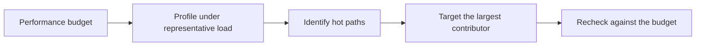

# Performance budgets and profiling

A performance budget is an explicit, measurable limit on a resource such as latency, memory, request count, or payload size, set before implementation and checked against it.

Profiling is the practice of measuring where a program spends time or resources, used to find the parts of a system that a budget should target.

## Why a budget helps

Without a stated budget, "fast enough" has no shared definition, and performance work competes for priority against features with no objective test.

A budget converts a vague goal into a specific, checkable constraint, such as a maximum end-to-end latency at a stated percentile, or a maximum memory footprint per active session.

:::tip[Attach a budget to a measured baseline]
A budget set without a current measurement can be unreasonable in either direction. Measure the existing system first, then set a budget that reflects a deliberate improvement or a deliberate limit on regression.
:::

## Setting a useful budget

A useful budget states:

- the metric, such as p95 latency, peak memory, or query count per request;
- the threshold value and the conditions under which it applies;
- the workload or load level the threshold assumes;
- what happens when the budget is exceeded, such as blocking a release or filing a tracked issue.

A budget with no consequence when exceeded tends to be ignored over time.

## Profiling to find where the budget is spent

A profiler attributes time or resource use to specific code paths, functions, or calls, instead of relying on assumption.

Sampling profilers periodically record the current call stack and have low overhead, which makes them suitable for production or near-production use.

Instrumenting profilers record every call and can produce precise counts, but their overhead can be high enough to change the behavior being measured.

A flame graph is a common way to visualize profiler output: stacked frames show which call paths consume the largest share of the profiled resource.

## Common traps

Profiling a build with debug instrumentation, or profiling on hardware unlike production, can point at a cost that does not appear under real conditions.

An instrumenting profiler's own overhead can distort the measurement, a form of the observer effect, and can make an unrelated code path appear more expensive than it is.

Chasing a budget by optimizing a path the profiler never flagged spends effort without improving the measured outcome.

Treating one profiling run as final ignores that hot paths shift as code, data volume, and traffic patterns change.

## Trade-offs

Continuous or production profiling gives realistic data but adds ongoing overhead and requires careful sampling to avoid measurable impact.

A strict budget enforced in continuous integration catches regressions early.
A budget that ignores legitimate variance, such as noisy shared build infrastructure, can produce false failures that erode trust in the check.

## When a lighter approach is enough

A small internal tool with no user-facing latency requirement may not need a formal budget or continuous profiling.

A single profiling session before a known-risky change, followed by measurement after the change, can be enough when performance is not a recurring concern for the system.

## Sources

- Lara Hogan. *Designing for Performance*. O'Reilly Media, 2014.
- Brendan Gregg. "Flame Graphs."
