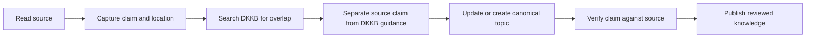

# Literature ingestion workflow

Use literature as evidence for canonical engineering knowledge. Do not mirror a book's table of contents inside DKKB.

The unit of capture is a useful claim or concept, not a chapter summary.



The diagram shows the normal flow. The ordered procedure below remains authoritative when a case needs more detail.

## Capture enough source metadata

Record enough information to find the source again:

- author or authors;
- work title;
- edition when it affects the content;
- publisher or venue when useful;
- publication year;
- chapter, section, page, or other stable location when available;
- ISBN, DOI, URL, or another stable identifier when available.

Do not delay a reading note only because every bibliographic field is not available. Preserve the fields needed for later verification.

## Workflow

1. **Capture the claim in original wording.** Write what the source appears to say without copying a substantial passage.
2. **Record the source location.** Keep enough metadata to verify the claim later.
3. **Search DKKB for overlap.** Prefer updating a canonical entry over creating a second page for the same concept.
4. **Classify the material.** Separate the author's claim from a recommendation that DKKB derives from it.
5. **Extract concepts.** Move reusable knowledge into the canonical topic that owns the concept.
6. **Add provenance.** Use `literature` for claims supported by literature. Add `derived-guidance` when DKKB combines evidence or reasoning into a recommendation.
7. **Verify before publication.** Reopen the cited source and check that it supports the material claim.
8. **Review the limits.** State context, trade-offs, and uncertainty that affect how the knowledge should be used.

## Keep source notes separate from canonical structure

A book can discuss testing, architecture, design, and team practice in one chapter. DKKB should place each reusable concept in its own canonical topic.

A source note can remain temporary. The durable output is the canonical entry that explains the engineering knowledge.

Do not create one DKKB page per book or chapter unless the work itself is the subject that readers need to understand.

## Separate source claims from DKKB guidance

A source claim describes what an author or work supports. DKKB guidance is a recommendation made after considering evidence, context, trade-offs, or other knowledge.

Do not silently convert one author's preference into a universal DKKB rule.

:::note[Source claim and DKKB guidance are different]
A cited author can support a technical claim without automatically defining DKKB's recommendation. When DKKB extends or combines source material, make that reasoning visible and record `derived-guidance` provenance.
:::

When DKKB extends a source, make the reasoning visible. Add `derived-guidance` provenance when that reasoning materially supports the recommendation.

## Represent conflicting sources

Do not hide a meaningful disagreement between credible sources.

When sources conflict:

1. verify that they address the same problem and context;
2. record the different assumptions or definitions;
3. prefer stronger or more direct evidence when one source is clearly better supported;
4. preserve both positions when each can be valid under different conditions;
5. state why DKKB prefers one approach if it makes a recommendation.

A disagreement is often a signal that the decision is contextual rather than a universal rule.

## Copyright boundary

Summarize in original wording. Short quotations should be exceptional and necessary for the technical point.

Do not copy protected diagrams, tables, long passages, or code only because they are useful. Recreate the explanation from the underlying concept and cite the source.

:::caution[Do not turn reading notes into copied material]
The goal is to preserve the engineering knowledge, not reproduce the source. Keep quotations short and necessary, and do not copy protected diagrams, tables, code, or long passages without permission or a compatible license.
:::

## Lightweight reading note

A temporary reading note can use this structure:

```text
Source: <work, edition, identifier>
Location: <chapter, section, page, or URL>
Concept: <canonical topic or candidate topic>
Claim: <summary in original wording>
Context: <conditions that affect the claim>
DKKB action: <update existing entry | create candidate | no action>
Verification: <not checked | checked>
```

Delete or archive the temporary note after its useful knowledge is represented canonically.

## Publication check

Before a literature-derived change is ready for merge, confirm that:

- the canonical topic is the right owner for the knowledge;
- the source can be found again;
- material claims are supported by the cited work;
- the text uses original wording;
- author claims and DKKB guidance are distinguishable;
- conflicts and trade-offs are visible when they matter;
- copied protected material was not added.
