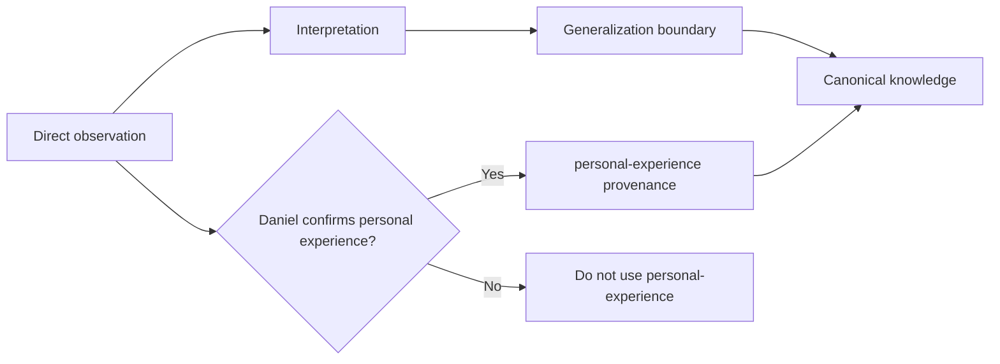

# Personal experience capture workflow

Use personal experience to record what Daniel Kindl can substantiate from his own work. Do not infer personal experience from repository history, AI output, or incomplete project context.

The goal is to preserve reusable lessons without turning DKKB into a project incident log.



The observation can support `personal-experience` provenance only after human confirmation. Interpretation and generalized guidance can require different provenance.

## Capture three layers separately

### Observation

Record what was directly observed. Include the system context that affects the observation.

Examples of useful context include workload, architecture, deployment model, team size, data volume, failure mode, or operational constraints.

Do not add a cause unless the evidence supports it.

### Interpretation

Record the explanation that best fits the observation. Mark uncertainty when other explanations remain plausible.

An interpretation is not automatically personal experience only because it follows a personal observation.

### Reusable guidance

Promote a lesson only when it can help a future engineering decision. State the conditions under which the lesson is likely to apply.

Use `derived-guidance` when the recommendation combines experience with reasoning or external evidence.

## Workflow

1. **Record the observed problem.** Describe the symptom and relevant project context.
2. **Remove unnecessary project detail.** Keep private names, customer data, credentials, internal URLs, and unrelated incident detail outside DKKB.
3. **Separate observation from interpretation.** Do not write a suspected cause as a fact.
4. **Search for an existing canonical entry.** Add evidence to an existing principle, problem, practice, or decision when it owns the lesson.
5. **Define the generalization boundary.** State which conditions were present and which conditions remain unknown.
6. **Add public evidence when useful.** Link public specifications, documentation, research, or reproducible examples without exposing private project data.
7. **Choose provenance deliberately.** Add `personal-experience` only for observations Daniel can substantiate. Add other provenance values for external evidence or derived recommendations.
8. **Review for privacy and attribution.** Remove details that are not required for the reusable lesson.

## Generalization boundary

A successful fix in one system does not prove a universal rule.

Before promoting a lesson, ask:

- Which system properties made this problem possible?
- Which constraints made the mitigation effective?
- What evidence would make the lesson invalid elsewhere?
- Is the lesson about a general mechanism or only one implementation?

State these limits near the recommendation.

## Public evidence without private disclosure

Prefer public evidence when it can explain the mechanism independently from the private project.

Useful evidence can include:

- a public specification that defines the relevant behavior;
- vendor documentation for an external dependency;
- an upstream issue or release note;
- a minimal reproduction that contains no private data;
- published research that explains the failure mode.

Do not publish private logs, customer data, proprietary code, internal architecture, or confidential incident details only to strengthen an entry.

## AI boundary

AI can help structure notes, search for related entries, and identify claims that need evidence. It must not decide that an event happened in Daniel's work.

An AI agent must not add `personal-experience` provenance unless Daniel supplied the observation or explicitly confirmed it.

:::danger[AI cannot manufacture personal experience]
Repository history, generated summaries, inferred project state, and plausible reconstruction are not personal experience. Use `personal-experience` only after Daniel directly supplies or confirms the observation.
:::

If provenance is uncertain, omit `personal-experience` and request human confirmation before publication.

## Temporary capture format

```text
Observed problem: <direct observation>
Context: <relevant system conditions>
Interpretation: <suspected cause and confidence>
Evidence: <public source or private evidence location>
Generalization limit: <where the lesson may not apply>
Canonical target: <existing entry or candidate topic>
Provenance: <personal-experience | derived-guidance | other>
Human confirmation: <required when personal-experience is used>
```

## Publication check

Before a personal-experience change is ready for merge, confirm that:

- Daniel can substantiate every claim marked as personal experience;
- observation and interpretation are not conflated;
- private project detail is not required to understand the lesson;
- limits on generalization are explicit;
- public evidence is linked when it materially improves verification;
- the reusable lesson lives in the canonical topic that owns it.
