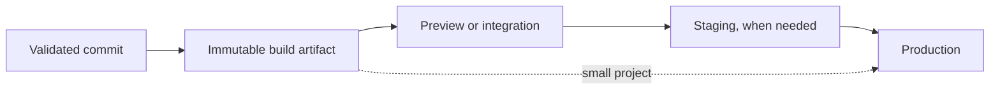

# Deployment environments and promotion

A deployment environment is a runtime context where a specific application state runs with environment-specific configuration, infrastructure, data access, and authority.

Common names include development, preview, integration, staging, and production. These names are conventions. The useful question is what evidence or operational boundary each environment provides.

## Distinguish the core objects

A branch, release, artifact, and environment are different things.

- A **branch** is a movable source-control reference.
- A **commit** identifies one source state.
- A **build artifact** is an executable or deployable result produced from source.
- A **release** is a versioned or otherwise identified candidate that is ready for deployment under a release policy.
- A **deployment environment** is a runtime target with its own configuration and operational authority.
- A **deployment** is the act of placing a chosen release or artifact into an environment.

A project can connect these objects by convention, but they should not be treated as synonyms.

For example, `main` can be the source branch, `v1.4.0` can be a release identifier, `sha256:...` can identify an artifact, and production can run that artifact with production configuration.

## Common environment types

### Local or development

A local or development environment supports fast implementation feedback.

It can run on a developer workstation, a container, a remote development workspace, or another isolated runtime.

Optimize this environment for iteration while keeping important production behavior reproducible.

Do not require exact production scale for every local workflow. Preserve the contracts that matter, such as database engine behavior, protocol versions, configuration shape, and migration semantics.

### Ephemeral preview

A preview environment is created for one pull request, branch, commit, or change set and removed when the review need ends.

It is useful for:

- user-interface review;
- integration checks that need a deployed system;
- stakeholder validation;
- testing environment configuration before integration.

Ephemeral environments reduce contention compared with one shared staging system. They also increase provisioning, data, secret, and cleanup requirements.

A preview should have bounded privileges and isolated data. Do not give every pull request production credentials only because the preview infrastructure is temporary.

### Shared development or integration

A shared integration environment runs changes from several contributors before production.

It can expose problems that isolated environments miss, such as interaction between services or shared infrastructure assumptions.

Its main weakness is ambiguity. When several changes arrive continuously, a failure can be difficult to attribute to one commit or artifact.

Treat a shared environment as evidence for a known deployed state, not as an uncontrolled place where "latest development" accumulates without traceability.

### Staging or pre-production

Staging is a persistent environment intended to approximate important production behavior before promotion.

It can support:

- production-like integration verification;
- migrations and deployment procedure checks;
- performance or operational rehearsal at a reduced scale;
- manual acceptance when the release process requires it.

Staging is valuable only when it predicts relevant production behavior.

A stale or materially different staging system can produce false confidence while adding maintenance cost.

### Production

Production serves real users, real dependent systems, or authoritative workloads.

Production normally has the strongest controls around:

- write authority;
- secrets;
- data access;
- change approval;
- observability;
- rollback or roll-forward paths;
- audit and incident response.

Production is not defined by a branch name. It is defined by the runtime authority and impact of the environment.

## Promotion

Promotion moves an already identified change or artifact toward a higher-authority environment after required evidence is satisfied.

A simple model is:



The intermediate environments are optional. The promotion policy should require only the stages that reduce a real delivery risk.

## Build once and promote the same artifact

One strong promotion model builds an immutable artifact once and moves that same artifact through environments.

Benefits include:

- staging and production execute the same application bits;
- build-tool or dependency drift cannot change the promoted binary between stages;
- provenance is easier to trace from production back to the validated artifact;
- rollback can select a previously known artifact rather than reconstructing one.

Environment-specific configuration remains separate from the artifact.

This follows the distinction between build, release, and run: code creates a build; deploy-specific configuration helps form a release; the environment runs that release.

## Rebuilding independently per environment

Some systems rebuild from source for each environment.

This can be acceptable when builds are reproducible and the environment requires distinct packaging.

It adds another question: did production receive the same result that earlier environments validated?

If rebuilds are required, preserve enough provenance to compare source commit, dependencies, build configuration, and artifact identity.

Do not call two artifacts equivalent only because they were built from the same branch name.

## Promote an identity, not "whatever is latest"

Promotion should identify the exact state being approved.

Useful identities include:

- commit SHA;
- immutable image digest;
- package checksum;
- signed build provenance;
- release identifier that resolves to immutable artifacts.

A branch tip is movable. Approving `main` and deploying it later can deploy a different commit if the branch advanced in between.

Bind approval and deployment to the same immutable state when approval is consequential.

## Environment parity and drift

Environment parity means keeping the characteristics that affect correctness close enough that earlier validation remains relevant.

Important parity dimensions include:

- backing-service type and compatible version;
- runtime version;
- network and security boundaries;
- configuration schema;
- migration behavior;
- deployment mechanism;
- feature-flag evaluation;
- observability needed to verify the result.

Exact parity is often impossible or too expensive. A staging system may use less capacity or sanitized data.

Document intentional differences and understand which failures they can hide.

### Environment drift

Drift occurs when an environment changes independently from the declared deployment configuration or from other environments that it is expected to represent.

Common causes include:

- manual server changes;
- different dependency versions;
- environment-specific patches;
- stale schema migrations;
- undocumented configuration values;
- long-lived shared environments that are rarely rebuilt.

Prefer reproducible provisioning and explicit configuration over manual repair of one environment.

## Configuration and secrets

Configuration varies between deploys even when application code does not.

Examples include:

- database endpoints;
- service credentials;
- canonical hostnames;
- region settings;
- external integration keys;
- capacity and operational limits.

Keep secrets out of source control and out of build artifacts when the same artifact must be promoted across trust boundaries.

Each environment should receive only the credentials and permissions it needs.

A preview environment should not automatically inherit production secrets. Staging should not receive write access to production data only to improve parity.

Parity does not override least privilege or data-isolation requirements.

## Automated and manually approved promotion

Promotion can be fully automated, manually approved, or use both depending on the boundary.

Automation is suitable when the required evidence is deterministic and the organization accepts automatic production changes after those gates pass.

Manual approval can be useful when:

- a regulated or contractual control requires it;
- release timing is a business decision;
- an irreversible operation needs explicit authority;
- production risk cannot yet be captured by deterministic gates.

Manual approval should approve a specific immutable state. It should not compensate for unreliable tests or unclear deployment identity.

The [continuous delivery versus continuous deployment](/dkkb/delivery/continuous-delivery-versus-continuous-deployment/) entry explains the promotion-authority distinction.

## Environment protection and deployment authority

Higher-impact environments should restrict who or what can deploy.

Controls can include:

- authenticated deployment identities;
- environment-specific credentials;
- required checks;
- approval rules;
- protected deployment jobs;
- audit records;
- time-limited or scoped production access.

The deployment system should know which artifact, actor, environment, and result belong to one promotion event.

## Post-deployment verification

A successful deployment command proves that the deployment mechanism finished. It does not prove that the application works correctly in the target environment.

Verify the deployed state with evidence appropriate to the service:

- health and readiness signals;
- smoke tests;
- error rate and latency;
- important business or domain invariants;
- migration readiness;
- selected user journeys.

The [rollback, roll-forward, and release verification](/dkkb/delivery/rollback-roll-forward-and-release-verification/) entry covers the recovery decision after verification fails.

## Branch-to-environment mappings

Mappings such as these are common:

```text
dev -> staging
main -> production
```

They are project conventions, not inherent properties of Git or deployment systems.

A branch-based mapping can be simple, but it can also couple source-control topology to environment topology unnecessarily.

Alternative models include:

- every pull request gets an ephemeral preview;
- `main` produces an artifact but production promotion is a separate action;
- a release tag selects an artifact for production;
- the same artifact is promoted through several environments without changing branches.

Choose branch mappings only when they simplify a real workflow.

## Small-project environment models

A small project does not automatically need permanent development, QA, staging, and production environments.

A reasonable model can be:

```text
local development
    -> ephemeral preview for pull requests
    -> production after CI and review
```

Add persistent staging when it provides evidence that previews and CI cannot provide reliably.

Examples include production-like migration rehearsal, complex multi-service integration, or a required acceptance boundary.

Every persistent environment adds infrastructure, configuration, secrets, monitoring, data management, and maintenance work.

## Failure modes

### Staging exists but does not predict production

The environment uses different services, versions, data shapes, or deployment procedures. Passing staging creates confidence without useful evidence.

### Latest branch tip is promoted instead of the approved state

The branch advances after approval, so production receives a commit that was never approved.

### Each environment rebuilds differently

A successful staging build and a production build share source history but not artifact identity or dependency resolution.

### Environment-specific code branches accumulate

Production and staging require different source branches with permanent patches. Promotion becomes source merging instead of deployment of one product state.

### Secrets spread downward

Preview or development environments receive production credentials for convenience, increasing blast radius.

### Permanent staging becomes a shared junk drawer

Several changes and manual fixes coexist, so failures are difficult to attribute and the environment cannot be reproduced.

## Practical guidance

Design each environment around one question:

1. what risk or evidence does this environment own;
2. which exact artifact or state is deployed there;
3. what configuration and authority differ from other environments;
4. how the state is promoted forward;
5. how deployment success is verified;
6. how the environment is recreated or repaired when it drifts.

Use fewer environments when additional stages do not improve a real decision.

## Sources

- [The Twelve-Factor App - Build, release, run](https://12factor.net/build-release-run)
- [The Twelve-Factor App - Dev/prod parity](https://12factor.net/dev-prod-parity)
- [The Twelve-Factor App - Config](https://12factor.net/config)
