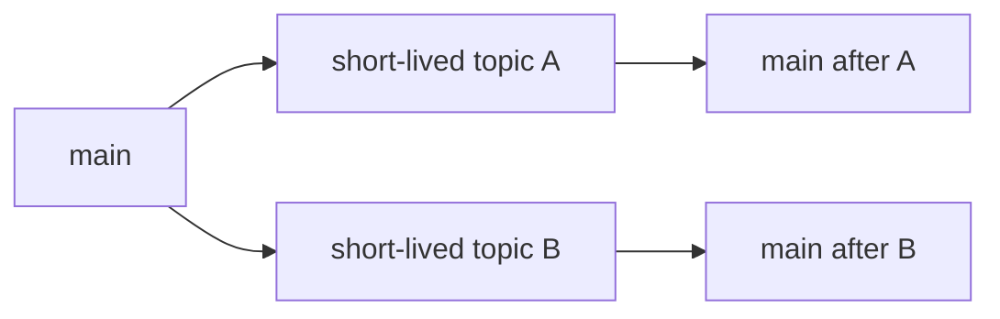
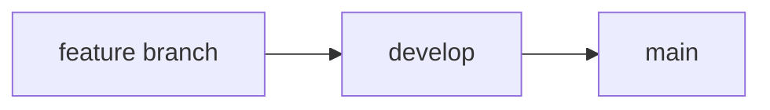
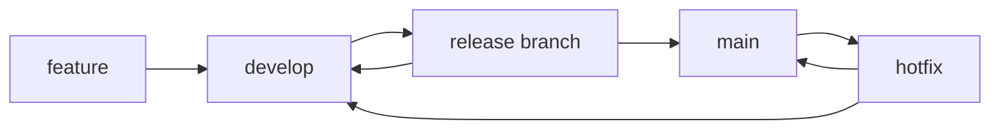

# Git branching strategies

A branching strategy defines how a team uses Git branches to isolate work, integrate changes, prepare releases, and protect important history.

Git does not assign business meaning to branch names. `main`, `develop`, `release/*`, and `feature/*` become meaningful only through repository policy.

## The main design variables

Branching models differ mainly in:

- which branches are long-lived;
- where normal work starts;
- where changes integrate first;
- how quickly branches converge;
- whether releases need isolated stabilization;
- how production fixes flow back into ongoing development.

The best model depends on release cadence, team size, CI confidence, support obligations, and the cost of integration.

## Trunk-based development

Trunk-based development keeps one primary integration branch, commonly `main` or `trunk`.

Developers either commit directly to trunk under strong controls or use short-lived topic branches that merge back quickly.



The central property is frequent convergence. Topic branches are temporary review and validation boundaries, not parallel long-lived lines of development.

This model favors:

- frequent integration;
- small changes;
- strong automated validation;
- feature flags or other techniques that keep incomplete work from requiring a long-lived branch;
- release directly from trunk or from short-lived release branches when necessary.

### Trade-offs

Frequent integration reduces merge debt, but it requires the integrated branch to remain healthy.

Large unfinished changes can be difficult unless they are decomposed, hidden behind flags, or introduced through backward-compatible steps.

A weak CI system can make rapid convergence unsafe because many changes reach the shared branch without enough evidence.

## Main plus a persistent development branch

Another model keeps `main` as the stable or production line and uses a persistent `dev` or `develop` branch for integration.



Feature work usually starts from and returns to the integration branch. `main` changes when the integrated state is promoted or released.

This model creates a buffer between daily integration and the stable branch.

### Trade-offs

A persistent integration branch can isolate unstable work from `main`, but it creates another long-lived line that must remain synchronized.

If `develop` remains far ahead of `main`, release preparation can become a large merge event instead of a small promotion decision.

The model can work well when releases are periodic and the team needs a persistent next-release line. It adds little value when every validated change is released directly from `main`.

## Git Flow

The classic Git Flow model uses two long-lived branches plus several temporary branch types:

- `main` or historically `master` for production-ready releases;
- `develop` for next-release integration;
- feature branches from `develop`;
- release branches from `develop`;
- hotfix branches from `main`.

A simplified flow is:



Release branches isolate stabilization while new development continues on `develop`. Hotfix branches let a production fix start from the released line and then return to both production and ongoing development.

Vincent Driessen later cautioned that Git Flow should not be treated as a universal standard. He recommends simpler workflows for continuously delivered software where multiple supported versions are not required.

### Trade-offs

Git Flow provides explicit release and hotfix lanes. It also has the highest coordination cost of the models described here.

Teams must keep changes synchronized across `develop`, release branches, hotfix branches, and `main`. Long-lived divergence increases conflict risk and makes it easier to forget a required back-merge.

Use the model because release isolation or parallel supported versions require it, not because the branch names are familiar.

## Release branches

A release branch is a temporary line created to stabilize a specific release while other development continues elsewhere.

It can be useful when:

- a release needs a longer verification or certification period;
- several released versions need support at the same time;
- only tightly scoped fixes should enter the release candidate;
- release preparation must not block future development.

A release branch also creates another compatibility and backport boundary.

Every fix applied only to the release branch needs an explicit decision about whether it must also return to the main development line.

Do not create permanent release branches when a tag or immutable artifact is enough to identify a release.

## Short-lived feature, fix, and topic branches

A topic branch isolates one coherent change from its base branch.

Common names include:

```text
feature/search-index
fix/timeout-handling
docs/versioning
```

The naming convention is local policy. Git treats all of these as ordinary branches.

Short branch lifetime reduces divergence. A small branch is usually easier to review, rebase or merge, validate, and delete after integration.

A feature branch becomes expensive when it accumulates unrelated work or remains open while its base changes substantially.

## Source-of-truth and integration branches

A repository should define which branch carries which authority.

Examples include:

- `main` is the canonical integrated history;
- `main` is production-ready but deployment requires a separate promotion action;
- `develop` is the next-release integration branch;
- a release branch is authoritative only for one supported release line.

Do not infer these meanings from the branch name alone.

The source-of-truth branch is a repository policy decision. The production environment is a deployment concern and can be separate from the branch topology.

## Keeping branches current

As a branch diverges from its base, the validation result can become stale because the final integrated state has not been tested.

Teams can reduce this risk by:

- merging or rebasing the current base into the topic branch before final integration;
- requiring branches to be current before merge;
- validating the prospective merge result;
- using a merge queue when many changes compete for the same protected branch.

A merge queue serializes validated integration against an up-to-date base. It does not remove the need for small changes and reliable CI.

## Branch protection

Important branches commonly have policy controls such as:

- required pull requests;
- required reviews;
- required status checks;
- restrictions on direct pushes;
- signed commit requirements;
- merge queues or rulesets.

Branch protection enforces repository policy. It does not make the protected branch correct by itself.

A protected branch with weak tests can still accept a bad change. A strong quality gate with unrestricted direct writes can still be bypassed.

## Branches and deployment environments

A branch can map to an environment, but the mapping is optional.

For example, a project can choose:

```text
develop -> staging
main -> production
```

This is a deployment convention, not a Git rule.

Another project can deploy every pull request to an ephemeral preview environment and promote an immutable artifact from `main` to production.

Avoid creating branches only because environment names exist. Branch topology should solve source-control and integration problems. Environment topology should solve runtime validation and deployment problems.

## Hotfix paths

A hotfix is an urgent change to a supported production state.

In a single-trunk model, the safest path is often to fix `main`, validate it, and deploy the new state.

When production corresponds to an older release line, the fix may need to start from that release branch or tag and then be forward-merged or reapplied to current development.

The key invariant is that the fix must not disappear from later versions.

## Failure modes

### Long-lived feature branches

A feature branch remains open for weeks while `main` changes. Integration becomes a separate project with large conflict and validation cost.

### Mechanical Git Flow

A small continuously deployed project maintains `main`, `develop`, release, and hotfix branches even though no release isolation requirement exists.

The team pays synchronization cost without receiving useful independence.

### Environment branches become configuration storage

`staging` and `production` branches contain environment-specific drift. Promotion becomes a merge between different source states rather than deployment of one validated artifact.

### Hotfixes do not return to active development

A production fix lands on an older release branch but is missing from the next release.

### Branch protection substitutes for integration design

Rules become stricter while branches remain large and long-lived. Merge debt remains because the real problem is delayed convergence.

## Choosing a model

Favor trunk-based development when changes can integrate frequently and CI can protect the shared branch.

Consider a persistent development branch when a stable release line and a separate next-release integration line have clear value.

Use release branches when release stabilization or parallel supported versions require temporary isolation.

Use Git Flow when its full release and hotfix structure solves real product constraints. Do not adopt it as a default template.

The simplest branch model that preserves the required release and integration boundaries is usually easier to operate.

## Sources

- [gitworkflows](https://git-scm.com/docs/gitworkflows)
- [Git Branching - Branching Workflows](https://git-scm.com/book/en/v2/Git-Branching-Branching-Workflows)
- [Trunk Based Development - Short-Lived Feature Branches](https://trunkbaseddevelopment.com/short-lived-feature-branches/)
- [A successful Git branching model](https://nvie.com/posts/a-successful-git-branching-model/)
