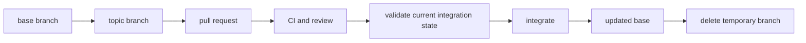

# Git workflows and merge strategies

A Git workflow defines how a change moves from a developer's working copy into shared repository history.

The workflow includes branch policy, commits, review, validation, conflict handling, merge method, and cleanup. Git provides the mechanisms. The repository decides the policy.

## A typical collaborative lifecycle

A pull-request-oriented workflow commonly follows this sequence:

1. create a topic branch from the intended base;
2. make one coherent set of changes and commits;
3. publish the branch and open a pull or merge request;
4. run automated checks and human review;
5. update the branch or prospective merge state when the base changes materially;
6. resolve conflicts and re-run affected validation;
7. integrate with the repository's chosen merge method;
8. delete the temporary branch when it no longer has independent value.



The exact commands are less important than the invariants: review the intended change, validate the state that will be integrated, preserve required traceability, and do not rewrite history that other contributors depend on without coordination.

## Keep the branch focused

A topic branch should represent one reviewable purpose when practical.

Small coherent branches reduce:

- review context;
- conflict surface;
- stale validation risk;
- rollback and diagnosis complexity;
- ambiguity about which issue or requirement the change satisfies.

A branch can contain several commits and files. Coherence matters more than a fixed commit or file count.

## Keep validation attached to the current state

A passing CI result belongs to a specific commit or prospective merge state.

If the branch changes after validation, or the base changes in a way that can affect the result, old evidence may no longer describe what will be merged.

Repositories can handle this with:

- a requirement that the branch is current with its base;
- revalidation after merge or rebase updates;
- validation of a synthetic merge commit;
- a merge queue that validates changes against the latest protected branch state.

The [continuous integration and quality gates](/dkkb/delivery/continuous-integration-and-quality-gates/) entry explains evidence and promotion boundaries in more detail.

## Merge commits

A merge commit connects the histories of the base and topic branches with an explicit integration commit.

Conceptually:

```text
A---B---C---M
     \     /
      D---E
```

The merge commit `M` records that the two histories were integrated.

### Benefits

- preserves individual topic-branch commits;
- preserves the branch integration point explicitly;
- can make a multi-commit feature or release branch visible as one historical unit;
- does not require rewriting topic commits before integration.

### Costs

- busy repositories can accumulate many merge commits;
- history is non-linear;
- weak intermediate commits remain part of permanent history;
- bisect and log inspection can require understanding both branch and merge structure.

Merge commits are useful when the individual commits and the fact of branch integration both carry long-term value.

## Squash merging

Squash merging combines the pull request's changes into one new commit on the base branch.

Conceptually:

```text
Topic: D---E---F
             |
             v
Base:  A---B---S
```

`S` contains the combined change represented by the pull request.

### Benefits

- gives one durable commit per logical pull request;
- removes fixup and review-only commit noise from the base history;
- makes reverting one pull request straightforward when the change is self-contained;
- supports a simple linear history.

### Costs

- individual topic commits are not retained on the base branch;
- commit-level authorship and reasoning inside the topic branch can be compressed;
- repeated squash merges from the same long-lived branch can make later conflict reasoning harder because the base does not contain the original topic commit identities.

### PR metadata becomes more important

When squash merging is the repository norm, the pull request title often becomes the durable commit subject.

The title should therefore describe the complete integrated change, not only the last implementation step.

A structured convention such as [Conventional Commits](/dkkb/practices/conventional-commits/) can be enforced at the pull request title when the repository treats that title as the canonical squash commit message.

The pull request body also becomes valuable durable context for issue links, validation evidence, trade-offs, and migration notes.

## Rebase and merge

Rebase-and-merge places each topic commit onto the current base without creating a merge commit.

The resulting history is linear, but the topic commits receive new parentage and therefore new commit identities.

Conceptually:

```text
Before:
A---B---C
     \
      D---E

After:
A---B---C---D'---E'
```

### Benefits

- preserves separate logical commits;
- produces a linear base history;
- avoids explicit merge commits.

### Costs

- commit identity changes;
- poor topic commits remain visible;
- repeated rebasing can require repeated conflict resolution;
- shared branches become dangerous when one contributor rewrites commits that another contributor has based work on.

Rebase-and-merge works best when individual commits are intentionally curated and useful as permanent history.

## Local rebase and fast-forward integration

A team can also rebase a private topic branch locally onto the latest base and then fast-forward the base to include those commits.

This can produce the same simple linear shape without a merge commit.

The important safety condition is ownership of the rewritten branch.

Rebasing an unpublished or single-owner topic branch is usually manageable. Rebasing a shared long-lived branch rewrites commit identities that other work may already reference.

## Rewritten history and force pushes

Rebase, amend, and some squash operations rewrite commit history.

Publishing rewritten history often requires replacing the remote branch tip.

Use a guarded update such as `--force-with-lease` rather than an unconditional force push when a force update is necessary. The lease checks that the remote state still matches the state the writer expects.

Even guarded force updates are inappropriate when the repository policy forbids rewriting a shared branch.

A useful rule is:

- rewriting your own short-lived topic branch can be acceptable;
- rewriting a branch used as a shared integration or release line requires explicit coordination and is usually avoided.

## Resolving conflicts

A merge or rebase conflict means Git cannot determine the intended combined content automatically.

Conflict resolution is a semantic decision, not a syntax cleanup step.

After resolving a conflict:

1. inspect the combined behavior rather than only the conflict markers;
2. run the checks affected by both sides of the change;
3. verify that no change was silently dropped;
4. update review context when the resolution materially changes the pull request.

Repeated conflicts are often a signal that branches are too long-lived or several changes modify the same unstable boundary.

## Protected branches

Important branches can require policy gates before integration.

Common controls include:

- pull requests instead of direct pushes;
- required reviews;
- required status checks;
- signed commits;
- linear-history rules;
- restrictions on who can push;
- merge queues.

Protection enforces a workflow invariant. It does not replace the quality of the checks or review.

## Merge queues

A merge queue is useful when several pull requests are ready at the same time and each must be validated against an up-to-date protected branch.

Without a queue, two pull requests can both pass against the same old base and then interact badly when merged sequentially.

A queue forms and validates candidate integration states in order before updating the protected branch.

The queue reduces the race between "CI passed" and "another change merged first." It does not make a failing or incomplete test suite stronger.

## Issue and pull-request traceability

A collaborative workflow should make it possible to answer why a change exists and which requirement it satisfied.

Useful links include:

- issue to pull request;
- pull request to final commit;
- final commit to release or deployment evidence when relevant.

Closing keywords can automate issue closure after merge, but automation should not replace a clear pull request description.

One pull request can legitimately address several issues when they form one inseparable change. Do not combine unrelated work only to reduce the number of pull requests.

## Choosing a merge strategy

| Strategy | Base history | Preserves topic commits | Rewrites topic commit identity | Explicit merge point |
| --- | --- | --- | --- | --- |
| Merge commit | Non-linear | Yes | No | Yes |
| Squash merge | Linear | No | Produces one new combined commit | No |
| Rebase and merge | Linear | Yes, as replayed commits | Yes | No |
| Local rebase + fast-forward | Linear | Yes, as replayed commits | Yes | No |

No strategy is universally superior.

Choose based on what the repository wants permanent history to represent.

Use merge commits when branch structure and individual commits are meaningful historical information.

Use squash merging when a pull request is the primary unit of review and history.

Use rebase-based integration when individual commits are curated and a linear history is valuable.

## Failure modes

### Stale validation

A branch passed CI before its base changed, then merged without validating the actual integrated state.

### Force-pushing shared history

A contributor rebases a branch that others use and invalidates their commit references and local ancestry.

### Squash titles are meaningless

The repository squashes every pull request, but titles such as `updates` become the permanent commit history.

### Merge commits preserve noise without purpose

Every experiment and fixup commit is retained even though the team never uses that detail during diagnosis or review.

### Rebase policy creates repeated conflicts

A large branch is rebased repeatedly because the workflow optimizes for linear history while ignoring branch lifetime.

### Workflow ceremony exceeds project risk

A small repository adds several branch gates, approval stages, and history rules that do not protect a real failure mode.

## Practical guidance

Define the repository policy in terms of the history and safety properties you need:

1. identify the normal unit of work;
2. define when review and CI evidence are sufficient;
3. decide whether individual topic commits need permanent meaning;
4. choose the merge strategy that preserves the intended history;
5. define when history rewriting is allowed;
6. protect important branches from bypassing the required gates;
7. delete temporary branches after their purpose ends.

Keep the workflow simpler than the coordination problem it solves.

## Sources

- [gitworkflows](https://git-scm.com/docs/gitworkflows)
- [git-merge](https://git-scm.com/docs/git-merge)
- [git-rebase](https://git-scm.com/docs/git-rebase)
- [Pull request merges, GitHub Docs](https://docs.github.com/en/pull-requests/reference/pull-request-merges)
- [About protected branches, GitHub Docs](https://docs.github.com/en/repositories/configuring-branches-and-merges-in-your-repository/managing-protected-branches/about-protected-branches)
