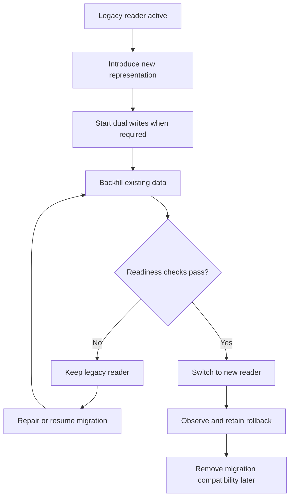

# Safe online data migrations

An online data migration changes persisted data while the system continues to serve traffic.

Use a staged migration when the new read path depends on data that cannot be created atomically for all existing records.

The key safety property is simple: do not switch reads until the new representation is complete and verified.

## Migration sequence

A safe migration commonly uses this order:

1. Introduce the new representation.
2. Start writing new changes to both representations when required.
3. Backfill existing records into the new representation.
4. Verify readiness with deterministic checks.
5. Switch reads to the new representation.
6. Observe the new read path and keep a rollback option.
7. Remove the legacy representation or compatibility path later.

The exact steps depend on the system. The important constraint is that each step preserves a valid read path.

## Start dual writes before the backfill

A backfill reads old records and creates equivalent data in the new representation. New writes can occur while the backfill runs.

If the system does not account for those writes, the backfill can finish with stale or missing data.

Start dual writes before the backfill when both representations must remain synchronized during the migration. The new representation then receives changes that happen after the migration starts.

Dual writes also add complexity. They can fail partially, increase write cost, and require reconciliation. Do not use them when a simpler migration can preserve correctness.

## Make the backfill resumable

A long backfill can stop because of deployment, process, database, or infrastructure failure.

Design the backfill so that it can resume without corrupting completed work. Idempotent operations are useful because repeated execution produces the same intended state.

A resumable backfill should make progress observable. It should also distinguish records that are complete from records that still need work.

Do not use process completion as proof that all required data is valid.

## Verify readiness, not intent

A migration flag can record that an operator intended to complete a migration. It does not prove that the required data exists.

Before the read-path switch, verify the properties that the new reader depends on. Useful checks can include:

- every required record has the new representation;
- derived values match the expected source values;
- uniqueness and referential invariants hold;
- no unsupported or malformed rows remain;
- reconciliation finds no unresolved divergence between old and new writes.

Prefer deterministic checks that test the actual persisted state.

The readiness condition should fail closed. If verification cannot prove that the new representation is ready, keep the existing reader active.

:::danger[Do not treat completion as readiness]
A completed migration job proves that the job stopped successfully. It does not prove that every invariant required by the new reader holds.

Verify the persisted state before cutover.
:::

## Keep the legacy reader during cutover

Do not remove the old read path in the same step that first activates the new one unless rollback is unnecessary and the change is proven atomic.

Keeping the legacy reader provides a recovery path if production behavior exposes a problem that pre-cutover checks did not detect.

The fallback path is temporary. Remove it after the new path has operated successfully for an appropriate observation period and the migration no longer needs rollback support.

## Common failure modes

### Backfill before dual writes

New updates can occur after a record was backfilled. The new representation can then become stale before cutover.

### One-shot backfill

A backfill that cannot resume safely can require a full restart after failure. Repeated work can also create duplicates or inconsistent derived state.

### Read switch based on a migration marker

A boolean such as `migration_complete` can become incorrect because of partial failure, manual intervention, or a defect in the migration process.

Verify the state that the reader needs instead of trusting the marker alone.

### Removing the old path too early

A migration can pass structural checks and still expose a semantic problem under production traffic. Immediate removal of the old path can turn a reversible migration into an incident.

### Permanent dual writes

Dual writes are a migration mechanism, not a default steady-state architecture. Keeping them indefinitely increases coupling and creates another consistency boundary.

## When a simpler migration is better

Do not use this process for every schema change.

A transactional migration can be better when the data set is small, the operation is bounded, and the required maintenance or lock window is acceptable.

A maintenance-window migration can also be simpler when temporary unavailability is allowed and reduces implementation risk.

Use the staged online process when availability requirements or migration size make an atomic cutover impractical.

## Practical rule

Treat migration readiness as a property of persisted state, not as a property of the deployment process.

Keep a known-good reader until the new representation satisfies explicit invariants and the new path has a controlled rollback strategy.
