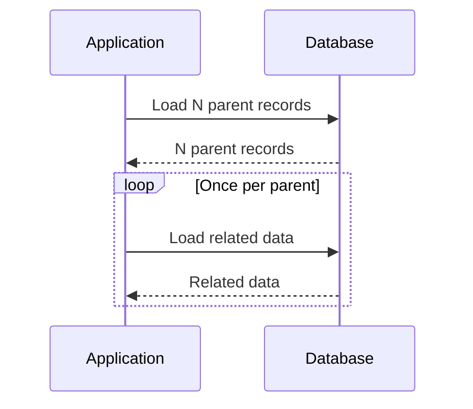

# N+1 query problem

The N+1 query problem occurs when one query returns N records and application code performs another query for each record.



A common application shape looks like this:

```ts title="n-plus-one.ts"
const games = await repository.loadGames();

for (const game of games)
{
    game.offers = await repository.loadOffers(game.id);
}
```

The loop turns one initial query into one additional round trip per game.

## Symptoms

Latency and database load grow with result size. A page that looks correct in small tests can become slow under realistic data volume.

## Detection

Count database round trips for one request. Use query logs, tracing, or ORM diagnostics to identify repeated statements that differ only by one key.

:::tip[Measure round trips, not only query time]
Each individual query can be fast while the request is slow because the application performs too many sequential database round trips.
:::

## Mitigation

Load related data in a bounded set of queries. Suitable techniques include joins, explicit eager loading, batch loaders, prefetching, or a query shaped for the read model.

## Trade-offs

Aggressive joins can duplicate rows, increase memory use, or fetch data that callers do not need. Eager loading every relation can replace many small queries with one excessively large query.

Optimize the access pattern that the caller actually uses.
